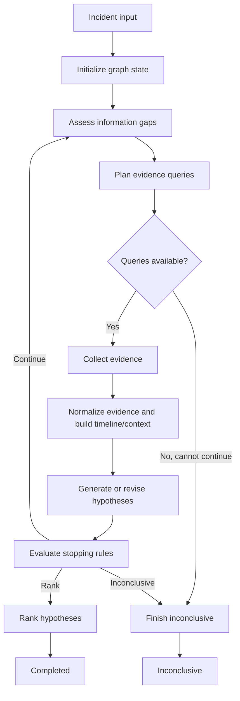

# RecoverIT LangGraph Migration and Three-Person Execution Plan

**Status:** Proposed implementation specification  
**Audience:** All three project contributors and their coding agents  
**Primary architecture reference:** `ARCHITECTURE.md`  
**Current baseline branch:** `integration`  
**Purpose:** Replace the custom orchestration engine with LangGraph, remove duplicate integration code, make runtime behavior project-neutral, and complete real data-source integrations without changing the mentor-approved investigation dataflow.

---

## 1. Read This First

This document is the shared implementation contract for the migration. Every contributor and every coding agent must read the entire document before changing code.

The project is **not** being restarted. Existing evidence processing, timeline construction, reasoning, ranking, CLI, web UI, tests, and useful source adapters will be retained where they satisfy this specification. The custom orchestration loop will be replaced by LangGraph.

The approved investigation flow remains:

1. Receive and validate an incident.
2. Assess missing information.
3. Plan source queries.
4. Collect evidence through typed, read-only tools.
5. Normalize, redact, deduplicate, and persist evidence.
6. Build the incident timeline and context.
7. Generate or revise competing hypotheses.
8. Apply deterministic stopping rules.
9. Continue gathering evidence, produce a ranked result, or finish inconclusively.

The final implementation must not contain runtime behavior that is selected by a known benchmark scenario. Scenarios and recorded fixtures remain useful for tests and evaluation, but they must be isolated from production execution.

### 1.1 Non-negotiable decisions

- LangGraph is the only workflow/state-machine implementation after migration.
- There is one canonical schema for each domain concept.
- Production code never silently substitutes fixture data for unavailable live data.
- Production code never silently falls back to a scenario-specific fake reasoning provider.
- Every investigation tool is read-only.
- A source that is not configured or cannot be reached returns an explicit unavailable result.
- The application must accept previously unseen services, repositories, alerts, logs, metrics, and source combinations.
- Domain and service code must not branch on scenario names, fixture names, expected root causes, or ground truth.
- Every cross-person interface in this document is frozen before parallel implementation starts.
- Contributors must not modify files owned by another contributor during parallel work.

### 1.2 Current verified baseline

At the time this plan was written:

- The repository contains approximately 19,059 lines of production Python and 15,879 lines of Python tests.
- The existing environment passes **584 tests and 40 subtests**.
- The main custom orchestrator contains approximately 1,648 lines.
- The custom state machine contains approximately 473 lines.
- The repository has multiple definitions of core contracts such as `IncidentSeed`, `RawEvidenceBatch`, `EvidenceQueryPlan`, and `IncidentContextSnapshot`.
- `integration_runtime/adapters.py` translates between these duplicate representations.
- Only local Git and file log collectors contain live collection logic.
- Metrics, deployments, pipelines, and configuration currently use fixture-only adapters.
- The current `run_target()` path loads `bad_db_config` fixture adapters for missing sources, which contaminates an arbitrary target investigation with benchmark data.

The passing test suite is the migration safety net. Behavior may change only where this document explicitly identifies incorrect scenario coupling, duplicate contracts, unsafe behavior, or missing live functionality.

---

## 2. Target Architecture



LangGraph owns:

- Node ordering and legal routing.
- The bounded investigation loop.
- Checkpointing of graph state.
- Resume behavior.
- Node-level retry configuration for transient failures.
- Streaming graph updates to the CLI and web application.

Plain Python services own:

- Source capability discovery.
- Query validation and collection.
- Evidence normalization, redaction, and deduplication.
- Timeline and context construction.
- LLM request construction and structured response parsing.
- Hypothesis validation and deduplication.
- Deterministic stopping rules and ranking.

LangGraph nodes are thin coordinators. A node reads graph state, calls one application service, and returns a state update. Business rules must not be embedded in graph routing functions.

---

## 3. Target Repository Structure

The following structure is the integration target. Existing useful implementations may be moved or adapted into these locations.

```text
contracts/
  common.py
  enums.py
  incident/
    __init__.py
    schemas.py
  collection/
    __init__.py
    schemas.py
  evidence/
    __init__.py
    schemas.py
  hypothesis/
    __init__.py
    schemas.py
  investigation/
    __init__.py
    schemas.py
  errors/
    __init__.py
    schemas.py

investigation/
  graph/
    __init__.py
    state.py
    ports.py
    dependencies.py
    builder.py
    routing.py
    nodes/
      __init__.py
      initialize.py
      assess.py
      plan.py
      collect.py
      build_context.py
      hypothesize.py
      evaluate.py
      rank.py
      finish.py
  budgets/
  missing_information/
  query_planning/

collectors/
  registry.py
  service.py
  validation.py
  specs.py
  base.py
  changes/
    local_git.py
  logs/
    file.py
  metrics/
    prometheus.py
  pipelines/
    github_actions.py
  deployments/
    kubernetes.py
  configuration/
    git_configuration.py
  health/
    http_health.py

evidence/
  application/
  normalization/
  security/
  deduplication/
  repositories/
  context/

timeline/
  builder/
  relationships/
  repositories/

reasoning/
  provider/
  hypotheses/
  ranking/

recoverit/
  composition.py
  runner.py
  cli.py
  web/

benchmarks/
  evaluator.py
  fixtures/
  providers/

tests/
  contracts/
  graph/
  collectors/
  evidence/
  reasoning/
  integration/
  support/
    scripted_source.py
    scripted_reasoning_provider.py
```

No model class may be defined in an `__init__.py` file. Package `__init__.py` files may only re-export canonical definitions from `schemas.py`.

---

## 4. Interface Freeze Before Parallel Work

A single foundation commit must be created before the three long-running branches begin. This is required if the team expects one final merge.

### 4.1 Foundation commit contents

The foundation commit must contain:

1. The canonical enums from Section 5.
2. The canonical Pydantic schemas from Section 6.
3. The graph `TypedDict` state definitions from Section 7.
4. The service protocols from Section 8.
5. Empty or minimally functional module files from the target repository structure.
6. Contract serialization tests.
7. Protocol conformance test helpers.
8. All third-party dependencies already agreed for the three workstreams.
9. This document.

Tag this commit:

```text
langgraph-interface-v1
```

All three feature branches must start from this exact tag. No contributor may independently recreate or change the contracts after branching.

### 4.2 Contract change procedure after the freeze

If a contributor discovers that a frozen interface is insufficient:

1. Do not edit the frozen contract or another person's files.
2. Add a request to `docs/contract-change-requests/PERSON_<N>.md`.
3. Include the affected type/function, the exact proposed change, the reason, and an example payload.
4. Continue with an internal adapter or private helper if possible.
5. The integration owner resolves accepted contract changes once, before the final merge.

This prevents three incompatible versions of the same schema from being created again.

---

## 5. Canonical Enumerations

All controlled cross-module values use these names and wire values. These definitions live in `contracts/enums.py`. No duplicate enum with the same purpose may exist elsewhere.

| Enum | Members and exact wire values |
|---|---|
| `Severity` | `INFO="info"`, `WARNING="warning"`, `CRITICAL="critical"` |
| `SourceType` | `LOGS="logs"`, `METRICS="metrics"`, `CHANGES="changes"`, `DEPLOYMENTS="deployments"`, `PIPELINES="pipelines"`, `CONFIGURATION="configuration"`, `HEALTH="health"` |
| `SourceStatus` | `OK="ok"`, `PARTIAL="partial"`, `EMPTY="empty"`, `UNAVAILABLE="unavailable"`, `TIMEOUT="timeout"`, `ERROR="error"` |
| `SourceCoverageStatus` | `NOT_QUERIED="not_queried"`, `AVAILABLE="available"`, `EMPTY="empty"`, `PARTIAL="partial"`, `UNAVAILABLE="unavailable"` |
| `Reliability` | `LOW="low"`, `MEDIUM="medium"`, `HIGH="high"` |
| `InformationPriority` | `LOW="low"`, `MEDIUM="medium"`, `HIGH="high"` |
| `InformationValueLevel` | `LOW="low"`, `MEDIUM="medium"`, `HIGH="high"` |
| `InformationGapCategory` | `SYMPTOM_CONFIRMATION="symptom_confirmation"`, `TEMPORAL_CORRELATION="temporal_correlation"`, `DIRECT_CAUSAL_EVIDENCE="direct_causal_evidence"`, `CONTRADICTING_EVIDENCE="contradicting_evidence"` |
| `EvidenceRole` | `CAUSE="cause"`, `EFFECT="effect"`, `CORRELATION="correlation"`, `CONTRADICTION="contradiction"`, `CONTEXT="context"` |
| `InvestigationState` | `RECEIVED`, `ASSESSING_GAPS`, `COLLECTING_EVIDENCE`, `BUILDING_TIMELINE`, `GENERATING_HYPOTHESES`, `RANKING`, `COMPLETED`, `INCONCLUSIVE`, `CANCELLED` |
| `InvestigationStatus` | `COMPLETED="completed"`, `INCONCLUSIVE="inconclusive"`, `CANCELLED="cancelled"` |
| `StopReason` | `SUFFICIENT_EVIDENCE="sufficient_evidence"`, `BUDGET_EXHAUSTED="budget_exhausted"`, `INSUFFICIENT_EVIDENCE="insufficient_evidence"`, `SOURCES_UNAVAILABLE="sources_unavailable"`, `REPEATED_INVALID_OUTPUT="repeated_invalid_output"`, `CANCELLED="cancelled"` |
| `StopAction` | `CONTINUE="continue"`, `RANK="rank"`, `INCONCLUSIVE="inconclusive"` |
| `HypothesisStatus` | `ACTIVE="active"`, `WEAKENED="weakened"`, `REJECTED="rejected"`, `SELECTED="selected"` |
| `ConfidenceLabel` | Preserve the current canonical values from `contracts/common.py`; only this enum definition remains after cleanup. |
| `RootCauseCategory` | Preserve current provider-neutral categories; do not add scenario names as categories. |
| `EvidenceType` | Preserve current operational evidence types; extensions must describe evidence, not expected diagnoses. |
| `TimelineCategory` | Preserve current timeline categories. |
| `RelationshipType` | Preserve current temporal relationship types. `CAUSES` must not be inferred from temporal proximity. |
| `RelationshipCreator` | Preserve current values, including deterministic and model/provider attribution where already supported. |

All timestamps crossing a module boundary must be timezone-aware and normalized to UTC during validation.

---

## 6. Canonical Schemas

All canonical models inherit from `ContractModel`, use Pydantic v2, reject unknown fields, and include `schema_version: Literal["1.0"] = "1.0"`.

`Any` is permitted only for raw source payloads, source-specific query parameters, extension attributes, and structured error details.

### 6.1 Incident schemas

File: `contracts/incident/schemas.py`

#### `IncidentAlert`

| Field | Type | Required/default | Meaning |
|---|---|---|---|
| `schema_version` | `Literal["1.0"]` | `"1.0"` | Contract version |
| `external_alert_id` | `str` | required | Stable idempotency identifier from the alert source |
| `service` | `str` | required | Affected service |
| `environment` | `str` | required | Runtime environment |
| `severity` | `Severity` | required | Alert severity |
| `detected_at` | `datetime` | required | Timezone-aware detection time |
| `message` | `str` | required | Untrusted alert message |
| `labels` | `dict[str, str]` | empty dictionary | Untrusted source labels |

#### `IncidentSeed`

| Field | Type | Required/default |
|---|---|---|
| `schema_version` | `Literal["1.0"]` | `"1.0"` |
| `incident_id` | `str` | required |
| `external_alert_id` | `str` | required |
| `service` | `str` | required |
| `environment` | `str` | required |
| `severity` | `Severity` | required |
| `detected_at` | `datetime` | required |
| `received_at` | `datetime` | required |
| `summary` | `str` | required |
| `labels` | `dict[str, str]` | empty dictionary |

### 6.2 Collection schemas

File: `contracts/collection/schemas.py`

#### `SourceCapability`

| Field | Type | Required/default |
|---|---|---|
| `source_type` | `SourceType` | required |
| `available` | `bool` | required |
| `supported_query_fields` | `list[str]` | empty list |
| `maximum_window_seconds` | `int` | `86400` |
| `maximum_items` | `int` | `1000` |
| `adapter_name` | `str` | required |
| `unavailable_reason` | `str | None` | `None` |

#### `SourceCapabilityCatalog`

| Field | Type | Required/default |
|---|---|---|
| `incident_id` | `str` | required |
| `generated_at` | `datetime` | required |
| `sources` | `list[SourceCapability]` | empty list |

Exactly one capability entry may exist for each `SourceType`. Missing source types are added by the registry as `available=False`; they are not omitted.

#### `EvidenceQuery`

This replaces both `EvidenceQueryPlanQuery` and the duplicate `EvidenceQuery` class.

| Field | Type | Required/default |
|---|---|---|
| `query_id` | `str` | required |
| `source_type` | `SourceType` | required |
| `question` | `str` | required |
| `parameters` | `dict[str, Any]` | empty dictionary |
| `related_information_ids` | `list[str]` | empty list |
| `discriminates_hypothesis_ids` | `list[str]` | empty list |
| `expected_information_value` | `InformationValueLevel` | `MEDIUM` |

#### `EvidenceQueryPlan`

| Field | Type | Required/default |
|---|---|---|
| `incident_id` | `str` | required |
| `plan_id` | `str` | required |
| `round_number` | `int` | required, minimum 1 |
| `queries` | `list[EvidenceQuery]` | empty list |
| `stop_reason` | `StopReason | None` | `None` |

Validation invariant: `queries` may be empty only when `stop_reason` is present. `stop_reason` may be present only when `queries` is empty.

#### `RawRecord`

| Field | Type | Required/default |
|---|---|---|
| `source_record_id` | `str` | required |
| `event_time` | `datetime | None` | `None` |
| `observed_at` | `datetime | None` | `None` |
| `content_type` | `str` | required |
| `payload` | `dict[str, Any]` | empty dictionary |

#### `SourceResult`

| Field | Type | Required/default |
|---|---|---|
| `query_id` | `str` | required |
| `source_type` | `SourceType` | required |
| `source_adapter` | `str` | required |
| `source_status` | `SourceStatus` | required |
| `truncated` | `bool` | `False` |
| `records` | `list[RawRecord]` | empty list |
| `warnings` | `list[str]` | empty list |
| `started_at` | `datetime` | required |
| `completed_at` | `datetime` | required |

#### `RawEvidenceBatch`

| Field | Type | Required/default |
|---|---|---|
| `incident_id` | `str` | required |
| `plan_id` | `str` | required |
| `batch_id` | `str` | required |
| `collected_at` | `datetime` | required |
| `results` | `list[SourceResult]` | empty list |
| `errors` | `list[StructuredError]` | empty list |

### 6.3 Evidence and context schemas

File: `contracts/evidence/schemas.py`

Retain the following current canonical models and fields from `contracts/evidence/schemas.py`:

- `EvidenceProvenance`
- `EvidenceQuality`
- `EvidenceRecord`
- `TimelineEvent`
- `TemporalRelationship`
- `EvidenceSummaryProjection`
- `IncidentSummary`
- `TimelineEventProjection`
- `IncidentContextSnapshot`

The selected schema is the existing Pydantic implementation in `contracts/evidence/schemas.py`. The dataclass implementations in `contracts/evidence/__init__.py`, `contracts/context/__init__.py`, and `contracts/timeline/__init__.py` are retired after consumers migrate.

Required `IncidentContextSnapshot` fields are:

| Field | Type |
|---|---|
| `snapshot_id` | `str` |
| `incident_id` | `str` |
| `revision` | `int` |
| `created_at` | `datetime` |
| `incident` | `IncidentSummary` |
| `evidence` | `list[EvidenceSummaryProjection]` |
| `timeline` | `list[TimelineEventProjection]` |
| `relationships` | `list[TemporalRelationship]` |
| `source_coverage` | `dict[str, SourceCoverageStatus]` |
| `warnings` | `list[str | dict[str, Any]]` |

`source_coverage` contains all seven source types. It must distinguish `not_queried`, `empty`, `partial`, `available`, and `unavailable`.

### 6.4 Investigation schemas

File: `contracts/investigation/schemas.py`

Retain these canonical models:

- `InvestigationBudget`
- `KnownFact`
- `MissingInformationItem`
- `MissingInformationAssessment`

Move `EvidenceQuery` and `EvidenceQueryPlan` to `contracts/collection/schemas.py` and import them from there everywhere.

#### `InvestigationBudget`

| Field | Type | Default |
|---|---|---|
| `max_rounds` | `int` | `6` |
| `max_queries` | `int` | `12` |
| `max_elapsed_seconds` | `int` | `900` |
| `max_reasoning_calls` | `int` | `10` |
| `max_input_units` | `int` | `100000` |
| `max_output_units` | `int` | `20000` |
| `minimum_hypotheses` | `int` | `2` |
| `maximum_hypotheses` | `int` | `5` |

#### `BudgetUsage`

Move the current `BudgetUsage` model from hypothesis contracts into investigation contracts.

| Field | Type | Default |
|---|---|---|
| `rounds` | `int` | `0` |
| `queries` | `int` | `0` |
| `reasoning_calls` | `int` | `0` |
| `input_units` | `int` | `0` |
| `output_units` | `int` | `0` |

#### `StopDecision`

| Field | Type | Default |
|---|---|---|
| `action` | `StopAction` | required |
| `reason` | `str` | required |
| `stop_reason` | `StopReason | None` | `None` |
| `criteria_status` | `dict[str, bool]` | empty dictionary |
| `unresolved_criteria` | `list[str]` | empty list |

The graph router uses only `StopDecision.action`; it must not recalculate stopping rules.

### 6.5 Hypothesis and result schemas

File: `contracts/hypothesis/schemas.py`

Retain the existing canonical Pydantic models:

- `EvidenceCitation`
- `Hypothesis`
- `HypothesisSet`
- `ScoreBreakdown`
- `RankedHypothesis`
- `RankedHypothesisSet`

`RankedHypothesisSet.budget_usage` imports the canonical `BudgetUsage` from investigation contracts.

No hypothesis field may contain a benchmark scenario identifier or expected answer.

### 6.6 Error and progress schemas

File: `contracts/errors/schemas.py`

#### `StructuredError`

| Field | Type | Default |
|---|---|---|
| `code` | `str` | required |
| `message` | `str` | required |
| `stage` | `str` | required |
| `retryable` | `bool` | `False` |
| `source_type` | `SourceType | None` | `None` |
| `details` | `dict[str, Any]` | empty dictionary |

Sensitive credentials, complete raw source payloads, and hidden model reasoning must never appear in `message` or `details`.

#### `ProgressEvent`

| Field | Type | Default |
|---|---|---|
| `event_id` | `str` | required |
| `incident_id` | `str` | required |
| `kind` | `str` | required |
| `stage` | `str` | required |
| `title` | `str` | required |
| `detail` | `str` | `""` |
| `output` | `str` | `""` |
| `metadata` | `dict[str, Any]` | empty dictionary |
| `created_at` | `datetime` | required |

---

## 7. LangGraph State Contract

File: `investigation/graph/state.py`  
Owner: Person 1  
Frozen before parallel work: Yes

Use `TypedDict` for LangGraph state. Do not store service objects, API clients, repositories, database connections, callbacks, or model clients inside graph state.

```python
class InvestigationInput(TypedDict):
    incident: IncidentSeed
    source_capabilities: SourceCapabilityCatalog
    budget: InvestigationBudget


class InvestigationGraphState(InvestigationInput, total=False):
    workflow_state: InvestigationState
    started_at: datetime
    round_number: int
    budget_usage: BudgetUsage
    missing_information: MissingInformationAssessment | None
    query_plan: EvidenceQueryPlan | None
    query_history: list[EvidenceQueryPlan]
    latest_batch: RawEvidenceBatch | None
    batch_history: list[RawEvidenceBatch]
    context: IncidentContextSnapshot
    hypotheses: HypothesisSet | None
    stop_decision: StopDecision | None
    ranked_result: RankedHypothesisSet | None
    errors: list[StructuredError]
    progress_events: list[ProgressEvent]


class InvestigationOutput(TypedDict):
    ranked_result: RankedHypothesisSet
    context: IncidentContextSnapshot
    query_history: list[EvidenceQueryPlan]
    batch_history: list[RawEvidenceBatch]
    errors: list[StructuredError]
    progress_events: list[ProgressEvent]
```

### 7.1 State variable rules

| Variable | Writer | Readers | Rule |
|---|---|---|---|
| `incident` | caller | all nodes | Immutable after invocation |
| `source_capabilities` | caller/composition root | assess, plan, collect | Immutable for one run |
| `budget` | caller | assess, plan, evaluate | Immutable |
| `workflow_state` | graph nodes | UI, audit | Must match approved architecture state |
| `started_at` | initialize node | evaluate | UTC timestamp; set once |
| `round_number` | initialize/evaluate | assess, plan, hypothesize | Starts at 1; increments only when continuing |
| `budget_usage` | initialize, assess, collect, hypothesize | plan, evaluate, output | Updated after successful calls |
| `missing_information` | assess | plan, evaluate | Replaced each round |
| `query_plan` | plan | collect, evaluate | Replaced each round |
| `query_history` | plan | plan, output | Append exactly one plan per round |
| `latest_batch` | collect | build context | Replaced after collection |
| `batch_history` | collect | output/debugging | Append exactly one batch per executed plan |
| `context` | initialize/build context | assess, hypothesize, evaluate, rank | Replaced with newest revision |
| `hypotheses` | hypothesize | assess, evaluate, rank | Generate in round 1, revise later |
| `stop_decision` | evaluate/plan failure | router, finish | Replaced after each evaluation |
| `ranked_result` | rank/finish | output | Written once in a terminal node |
| `errors` | any node | finish/output | Append sanitized structured errors |
| `progress_events` | any node | UI/output | Append display-safe events |

Lists are replaced with a new list in node updates (`[*old, new]`). Do not use an additive reducer until idempotent retry semantics are explicitly implemented, because retries could duplicate history entries.

---

## 8. Frozen Service Protocols

File: `investigation/graph/ports.py`  
Owner: Person 1 during foundation freeze

These are the only interfaces graph nodes use. Concrete classes may have private helpers, but their public cross-owner methods must match these signatures.

```python
@runtime_checkable
class CollectionService(Protocol):
    async def collect(
        self,
        plan: EvidenceQueryPlan,
        capabilities: SourceCapabilityCatalog,
    ) -> RawEvidenceBatch: ...


@runtime_checkable
class ContextBuilder(Protocol):
    async def build(
        self,
        incident: IncidentSeed,
        batch: RawEvidenceBatch,
        previous_context: IncidentContextSnapshot,
    ) -> IncidentContextSnapshot: ...


@runtime_checkable
class MissingInformationService(Protocol):
    async def assess(
        self,
        incident: IncidentSeed,
        capabilities: SourceCapabilityCatalog,
        context: IncidentContextSnapshot,
        hypotheses: HypothesisSet | None,
        previous_assessment: MissingInformationAssessment | None,
    ) -> MissingInformationAssessment: ...


@runtime_checkable
class QueryPlanningService(Protocol):
    async def plan(
        self,
        assessment: MissingInformationAssessment,
        capabilities: SourceCapabilityCatalog,
        context: IncidentContextSnapshot,
        hypotheses: HypothesisSet | None,
        budget: InvestigationBudget,
        budget_usage: BudgetUsage,
        round_number: int,
        query_history: list[EvidenceQueryPlan],
    ) -> EvidenceQueryPlan: ...


@runtime_checkable
class HypothesisService(Protocol):
    async def generate(
        self,
        incident: IncidentSeed,
        context: IncidentContextSnapshot,
        budget: InvestigationBudget,
    ) -> HypothesisSet: ...

    async def revise(
        self,
        incident: IncidentSeed,
        previous_hypotheses: HypothesisSet,
        context: IncidentContextSnapshot,
        assessment: MissingInformationAssessment,
    ) -> HypothesisSet: ...


@runtime_checkable
class StoppingService(Protocol):
    def evaluate(
        self,
        context: IncidentContextSnapshot,
        hypotheses: HypothesisSet | None,
        assessment: MissingInformationAssessment,
        query_plan: EvidenceQueryPlan,
        budget: InvestigationBudget,
        budget_usage: BudgetUsage,
        round_number: int,
    ) -> StopDecision: ...


@runtime_checkable
class RankingService(Protocol):
    def rank(
        self,
        hypotheses: HypothesisSet,
        context: IncidentContextSnapshot,
        budget_usage: BudgetUsage,
        status: InvestigationStatus,
        stop_reason: StopReason | None,
        remaining_uncertainty: list[str],
    ) -> RankedHypothesisSet: ...


@runtime_checkable
class ProgressSink(Protocol):
    def emit(self, event: ProgressEvent) -> None: ...


@runtime_checkable
class Clock(Protocol):
    def now(self) -> datetime: ...
```

### 8.1 Graph dependencies

File: `investigation/graph/dependencies.py`

```python
@dataclass(frozen=True, slots=True)
class GraphDependencies:
    collection_service: CollectionService
    context_builder: ContextBuilder
    missing_information_service: MissingInformationService
    query_planning_service: QueryPlanningService
    hypothesis_service: HypothesisService
    stopping_service: StoppingService
    ranking_service: RankingService
    progress_sink: ProgressSink
    clock: Clock
```

Use LangGraph runtime context or a node factory closure to provide `GraphDependencies`. Do not checkpoint this object.

---

## 9. LangGraph Functions and Node Contracts

### 9.1 Graph construction

File: `investigation/graph/builder.py`

```python
def build_investigation_graph(
    dependencies: GraphDependencies,
    checkpointer: BaseCheckpointSaver | None = None,
) -> CompiledStateGraph: ...
```

Required node names:

```text
initialize
assess_gaps
plan_queries
collect_evidence
build_context
hypothesize
evaluate_stopping
rank_hypotheses
finish_inconclusive
```

Node names are externally visible in traces and must not be changed independently.

### 9.2 Node signatures and updates

All node functions are asynchronous for a consistent execution model:

```python
async def <node_name>(
    state: InvestigationGraphState,
    dependencies: GraphDependencies,
) -> dict[str, object]: ...
```

| Node | Reads | Writes | Service call |
|---|---|---|---|
| `initialize` | input fields | initial context, usage, histories, state, time | None |
| `assess_gaps` | incident, capabilities, context, hypotheses, prior assessment | assessment, usage, state, progress | `MissingInformationService.assess` |
| `plan_queries` | assessment, capabilities, context, hypotheses, budget, usage, history | plan, plan history, progress | `QueryPlanningService.plan` |
| `collect_evidence` | plan, capabilities | latest batch, batch history, usage, state, progress | `CollectionService.collect` |
| `build_context` | incident, latest batch, current context | new context revision, state, progress | `ContextBuilder.build` |
| `hypothesize` | incident, context, hypotheses, assessment, budget | hypotheses, usage, state, progress | `generate` or `revise` |
| `evaluate_stopping` | context, hypotheses, assessment, plan, budget, usage, round | stop decision, progress | `StoppingService.evaluate` |
| `rank_hypotheses` | hypotheses, context, usage, decision | ranked result, terminal state, progress | `RankingService.rank` |
| `finish_inconclusive` | current state, errors, decision | ranked result, terminal state, progress | `RankingService.rank` |

No graph node may inspect a scenario name or expected diagnosis.

### 9.3 Routing functions

File: `investigation/graph/routing.py`

```python
def route_after_plan(state: InvestigationGraphState) -> Literal[
    "collect_evidence",
    "finish_inconclusive",
]: ...


def route_after_evaluation(state: InvestigationGraphState) -> Literal[
    "assess_gaps",
    "rank_hypotheses",
    "finish_inconclusive",
]: ...
```

Rules:

- `route_after_plan` returns `collect_evidence` when `query_plan.queries` is non-empty.
- It returns `finish_inconclusive` when the plan has zero queries and a stop reason.
- `route_after_evaluation` maps `StopAction.CONTINUE` to `assess_gaps`.
- Before continuing, `evaluate_stopping` increments `round_number` by one.
- It maps `StopAction.RANK` to `rank_hypotheses`.
- It maps `StopAction.INCONCLUSIVE` to `finish_inconclusive`.
- Routing functions do not mutate state and do not call services.

### 9.4 Checkpointing

- Development and tests use `InMemorySaver`.
- Local runnable application uses `SqliteSaver` with a configured path.
- A production deployment may use `PostgresSaver`.
- Graph invocation uses `incident.incident_id` as the LangGraph `thread_id`.
- The checkpointer is configured in the composition root, not inside graph nodes.
- No in-memory saver may be described as durable across process restarts.

---

## 10. Collection and Tool Contracts

### 10.1 Source adapter protocol

File: `collectors/base.py`  
Owner: Person 2

```python
@runtime_checkable
class SourceAdapter(Protocol):
    source_type: SourceType
    adapter_name: str

    def get_capability(self, incident: IncidentSeed) -> SourceCapability: ...

    async def query(self, query: EvidenceQuery) -> SourceResult: ...
```

All adapters are read-only. A collector must never initialize a Git repository, create a commit, modify configuration, retry a pipeline, restart a workload, or call a mutating API.

### 10.2 Source registry

File: `collectors/registry.py`

```python
class SourceRegistry:
    def __init__(self, adapters: Iterable[SourceAdapter] = ()) -> None: ...

    def register(self, adapter: SourceAdapter) -> None: ...

    def get(self, source_type: SourceType) -> SourceAdapter | None: ...

    def capabilities(self, incident: IncidentSeed) -> SourceCapabilityCatalog: ...
```

Rules:

- Registering two adapters for the same source type raises `DuplicateSourceAdapterError`.
- `capabilities()` always returns one entry for every `SourceType`.
- Unregistered source types are returned as unavailable.
- Capability discovery failure is converted to an unavailable capability with a sanitized reason.
- Registry behavior does not depend on service name or scenario.

### 10.3 Collection service

File: `collectors/service.py`

```python
class DefaultCollectionService:
    def __init__(
        self,
        registry: SourceRegistry,
        clock: Clock,
        id_factory: IdentifierFactory,
        max_concurrency: int = 4,
        query_timeout_seconds: float = 10.0,
    ) -> None: ...

    async def collect(
        self,
        plan: EvidenceQueryPlan,
        capabilities: SourceCapabilityCatalog,
    ) -> RawEvidenceBatch: ...
```

Public helper protocols:

```python
class IdentifierFactory(Protocol):
    def new_id(self, prefix: str) -> str: ...
```

Query execution requirements:

- Validate every query against the corresponding source capability.
- Reject unknown parameters.
- Enforce maximum time window and result limit.
- Run independent queries concurrently with bounded concurrency.
- Apply an individual timeout to each query.
- Convert source exceptions into `SourceResult` plus `StructuredError`.
- Preserve one result per query, including failed queries.
- Never synthesize successful evidence when a source fails.

### 10.4 Real adapter set

The default reference stack is below. If the team uses another infrastructure stack, the replacement choice must be recorded before `langgraph-interface-v1` is tagged.

| Class | File | Real source | Required query behavior |
|---|---|---|---|
| `LocalGitChangeAdapter` | `collectors/changes/local_git.py` | Existing local Git repository | Commit history, metadata, changed files, bounded diff excerpts, time/path/branch filters |
| `FileLogAdapter` | `collectors/logs/file.py` | Real text or JSON log files | Time, severity, service, pattern, correlation-id, and result-limit filters |
| `PrometheusMetricAdapter` | `collectors/metrics/prometheus.py` | Prometheus HTTP API | Allowlisted metric/query templates, bounded range queries, units and timestamps |
| `GitHubActionsPipelineAdapter` | `collectors/pipelines/github_actions.py` | GitHub Actions API | Workflow runs, jobs, conclusions, branch/SHA/time filters, failure summaries |
| `KubernetesDeploymentAdapter` | `collectors/deployments/kubernetes.py` | Kubernetes read APIs | Deployment/revision/image/status history and pod rollout observations |
| `GitConfigurationAdapter` | `collectors/configuration/git_configuration.py` | Git history for configured paths | Versioned configuration diffs with secret redaction and bounded excerpts |
| `HttpHealthAdapter` | `collectors/health/http_health.py` | Configured HTTP health endpoints | Status, latency, response timestamp, allowlisted response fields |

Credentials and endpoints are supplied by configuration or environment variables. They are never stored in graph state, evidence payloads, progress events, or reports.

### 10.5 Fixture rules

- Fixture adapters move to `tests/support/` or `benchmarks/fixtures/`.
- Production packages under `collectors/`, `investigation/`, `reasoning/`, and `recoverit/` must not import fixture loaders.
- A benchmark may explicitly compose fixture adapters.
- A production run with no configured metrics adapter reports metrics as unavailable.
- There is no baseline scenario argument in production runner methods.

---

## 11. Runtime Composition and Public Application API

### 11.1 Runtime settings

File: `recoverit/composition.py`  
Owner: Person 1

```python
class RuntimeMode(StrEnum):
    LIVE = "live"
    BENCHMARK = "benchmark"
    TEST = "test"


class RuntimeSettings(BaseModel):
    mode: RuntimeMode
    checkpoint_database_path: Path | None = None
    llm_provider: str
    llm_model: str
    max_concurrency: int = 4
    query_timeout_seconds: float = 10.0
    source_configs: list[SourceAdapterConfig] = Field(default_factory=list)


class SourceAdapterConfig(BaseModel):
    source_type: SourceType
    implementation: str
    enabled: bool = True
    options: dict[str, Any] = Field(default_factory=dict)
```

`implementation` is a registered adapter factory name, such as `local_git`, `file_log`, or `prometheus`. It is configuration, not a Python import path supplied by an untrusted request.

### 11.2 Runtime container

```python
@dataclass(frozen=True, slots=True)
class RuntimeContainer:
    settings: RuntimeSettings
    registry: SourceRegistry
    graph: CompiledStateGraph
```

```python
def build_runtime(settings: RuntimeSettings) -> RuntimeContainer: ...
```

`build_runtime()` is the only production composition root. It creates adapters, services, dependencies, checkpointer, and graph. Tests may construct dependencies directly.

### 11.3 Runner

File: `recoverit/runner.py`

```python
class InvestigationRunner:
    def __init__(self, runtime: RuntimeContainer) -> None: ...

    async def run(
        self,
        incident: IncidentSeed,
        budget: InvestigationBudget | None = None,
    ) -> InvestigationResult: ...

    async def resume(self, incident_id: str) -> InvestigationResult: ...
```

There is no `baseline_scenario` parameter and no automatic fake provider fallback.

Benchmark execution is separate:

```python
class BenchmarkRunner:
    async def run_scenario(self, scenario_name: str) -> BenchmarkResult: ...
```

`BenchmarkRunner` lives under `benchmarks/` and may use fixtures and scripted providers.

---

## 12. Removing Scenario-Coupled Behavior

The following runtime behavior must be removed:

- `SCENARIO_PRESET_MAP` in `recoverit/runner.py`.
- Loading `bad_db_config` or any other scenario inside `run_target()`.
- Defaulting the web investigation request to `incident_001` for normal investigations.
- Selecting hypotheses based on preset names inside production reasoning.
- Treating benchmark ground truth as agent-visible context.
- Returning a successful-looking result from fixture adapters when no live source is configured.

The following may remain, but only under benchmark/test packages:

- The five existing benchmark scenarios.
- Recorded model responses.
- Deterministic scripted source results.
- Ground-truth evaluation.
- Scenario list and benchmark report commands.

Production and benchmark commands must be visibly separate:

```text
recoverit investigate --config recoverit.yaml --incident incident.json
recoverit benchmark --scenario incident_001
```

---

## 13. Code Readability and Deletion Rules

### 13.1 Readability rules

- A module should normally remain below 400 lines.
- A function should normally remain below 60 lines.
- Graph nodes perform one stage and call one primary service.
- Public functions and classes require complete type annotations and concise docstrings.
- Private helpers begin with `_` and remain inside the owner's module.
- No code identifier may contain `person1`, `person2`, or `person3` after migration.
- No internal boundary converts one canonical model into another representation of the same concept.
- Avoid re-export chains. Import canonical types from their defining `schemas.py` module.
- `Any` is forbidden at service boundaries except where explicitly allowed in Section 6.
- Comments explain constraints and reasons; they do not narrate obvious code.
- Do not add abstract factories, base classes, or repositories unless at least two implementations or a real boundary require them.

These are review guidelines rather than mechanical reasons to split a cohesive 65-line function into artificial fragments.

### 13.2 Files expected to be deleted after migration

Delete only after all consumers use canonical replacements and tests pass:

```text
integration_runtime/
investigation/orchestration/orchestrator.py
investigation/orchestration/state_machine.py
contracts/collection/batch.py
contracts/collection/capabilities.py
contracts/collection/query_plan.py
contracts/incident/seed.py
contracts/incident/alert.py
contracts/context/__init__.py          # model implementation; package may remain if needed
collector fixture adapters under collectors/
scenario-specific fake provider from production reasoning package
```

Package initializers may remain as small re-export files.

Deletion is not measured only by line count. The integration is complete when duplicate responsibilities and representations are gone.

---

## 14. Person 1: Graph, Contracts, and Integration Owner

### 14.1 Mission

Person 1 owns the frozen contracts, LangGraph workflow, runtime composition, runner integration, checkpointing, CLI/web connection to the new runner, and final merge.

Person 1 does not implement source-specific collection logic or evidence/reasoning internals.

### 14.2 Exclusive file ownership

```text
contracts/**
investigation/graph/**
recoverit/composition.py
recoverit/runner.py
recoverit/cli.py
recoverit/web/**
tests/contracts/**
tests/graph/**
tests/integration/**
pyproject.toml
```

During the parallel phase, only Person 1 modifies these paths.

### 14.3 Required deliverables

1. Create the `langgraph-interface-v1` foundation commit.
2. Consolidate canonical schemas and enums.
3. Add LangGraph dependencies and selected checkpoint backend dependencies.
4. Implement the graph state, dependencies, nodes, routing, and builder.
5. Implement checkpoint configuration and `thread_id` usage.
6. Replace the runner's direct `InvestigationOrchestrator` usage with graph invocation.
7. Keep benchmark execution separate from live execution.
8. Update CLI and web endpoints to invoke the generic runner.
9. Stream `ProgressEvent` updates from graph execution.
10. Own the final integration branch and merge procedure.
11. Delete legacy orchestration after parity is proven.

### 14.4 Person 1 acceptance tests

- Graph compiles with no orphan nodes.
- Happy path follows every approved state in order.
- Continue route performs a second assessment round.
- Empty query plan routes to inconclusive.
- Sufficient evidence routes to ranking and completion.
- Budget exhaustion routes to inconclusive.
- Checkpoint state can be loaded using the incident ID.
- Graph state contains no service/client objects.
- Existing CLI and web result DTOs remain usable.
- Runtime modules contain no benchmark fixture imports.

### 14.5 Person 1 must not

- Add scenario-specific routing.
- Reimplement collector filtering.
- Reimplement evidence normalization or ranking inside nodes.
- Change Person 2 or Person 3 owned files during parallel development.
- Resolve integration uncertainty by adding another translation adapter.

---

## 15. Person 2: Real Tools and Collection Owner

### 15.1 Mission

Person 2 owns source registration, capability discovery, query validation, bounded concurrent collection, and every real source adapter.

Person 2 produces canonical `RawEvidenceBatch` objects and does not interpret root cause.

### 15.2 Exclusive file ownership

```text
collectors/**
ingestion/capabilities/**
tests/collectors/**
tests/support/scripted_source.py
docs/contract-change-requests/PERSON_2.md
```

### 15.3 Required deliverables

1. Implement `SourceAdapter`, `SourceRegistry`, and `DefaultCollectionService` exactly as defined.
2. Retain and harden real local Git collection.
3. Remove Git initialization and commit creation from investigation behavior.
4. Retain and harden real file log collection.
5. Implement the selected real metrics adapter.
6. Implement the selected real pipeline adapter.
7. Implement the selected real deployment adapter.
8. Implement the selected real configuration adapter.
9. Implement the real HTTP health adapter.
10. Ensure all adapters are configured, read-only, bounded, and source-neutral.
11. Move fixture adapters out of production collectors.
12. Add a shared adapter contract test suite and run it against every adapter.

### 15.4 Adapter contract tests

Every adapter must pass tests for:

- Correct `source_type` and stable `adapter_name`.
- Accurate capability availability.
- Supported query fields.
- Start/end time filtering.
- Service filtering where supported.
- Result limit and truncation.
- Empty successful result.
- Unavailable source.
- Timeout behavior.
- Malformed source response.
- Sanitized errors.
- Stable provenance identifiers.
- No source mutation.
- No fixed scenario values in returned records.

### 15.5 Person 2 must not

- Modify canonical contracts after the interface freeze.
- Modify graph nodes or runtime runner code.
- Generate hypotheses or confidence scores.
- Insert synthetic records when a source is missing.
- Put credentials into payloads, errors, or logs.
- Make a write request to an investigated system.

---

## 16. Person 3: Evidence, Reasoning, and Ranking Owner

### 16.1 Mission

Person 3 owns the complete transformation from canonical raw evidence to canonical context and from context to ranked hypotheses. This includes normalization, redaction, deduplication, timeline construction, missing-information assessment, query planning, provider-neutral LLM calls, hypothesis lifecycle, citation validation, stopping rules, and deterministic ranking.

Person 3 exposes the frozen service protocols. Person 3 does not control graph routing.

### 16.2 Exclusive file ownership

```text
evidence/**
timeline/**
reasoning/**
investigation/budgets/**
investigation/missing_information/**
investigation/query_planning/**
tests/evidence/**
tests/reasoning/**
tests/support/scripted_reasoning_provider.py
docs/contract-change-requests/PERSON_3.md
```

### 16.3 Required deliverables

1. Make context building accept canonical `IncidentSeed`, `RawEvidenceBatch`, and `IncidentContextSnapshot` directly.
2. Remove Person 1/2/3 conversion code and duplicate DTO assumptions.
3. Preserve redaction before model exposure or evidence persistence.
4. Preserve deterministic deduplication and stable evidence IDs.
5. Preserve timeline ordering and relationship rules.
6. Adapt missing-information assessment to the frozen protocol.
7. Adapt query planning to use runtime source capabilities rather than scenario knowledge.
8. Ensure query parameters are limited to fields advertised by capabilities.
9. Consolidate hypothesis generation and revision behind `HypothesisService`.
10. Preserve citation validation against evidence IDs in the current context.
11. Return `StopDecision` from deterministic stopping rules.
12. Adapt ranking to the frozen `RankingService` protocol.
13. Move scenario-specific fake reasoning to benchmark/test support.
14. Retain live LLM support with schema-validated structured output.

### 16.4 Person 3 acceptance tests

- Unknown services and previously unseen incident summaries are accepted.
- Context building works with any valid source combination.
- An unavailable source remains unavailable and creates no evidence.
- Secrets are absent from evidence, model requests, errors, and progress events.
- Duplicate raw records collapse deterministically while retaining provenance.
- Timeline order is deterministic.
- Temporal proximity does not create causal proof.
- Planner emits only advertised source parameters.
- Planner avoids materially duplicate historical queries.
- Hypotheses cite only existing evidence IDs.
- At least two alternatives are considered when the budget permits.
- Ranking remains deterministic for a fixed context.
- No production reasoning branch references scenario IDs or expected categories.

### 16.5 Person 3 must not

- Modify canonical contracts after the interface freeze.
- Modify graph state, routing, runner, CLI, or web code.
- Call source adapters directly.
- Return benchmark ground truth to the graph.
- Store provider-specific response objects in canonical contracts.

---

## 17. Parallel Development Without Frequent Merges

The team may perform one final feature merge, but only after the interface freeze.

### 17.1 Branches

Create all branches from `langgraph-interface-v1`:

```text
feature/langgraph-core       # Person 1
feature/live-collectors      # Person 2
feature/evidence-reasoning   # Person 3
```

Do not create long-lived branches from different base commits.

### 17.2 How each branch runs independently

- Person 1 uses scripted implementations of every frozen service protocol from `tests/graph/support/`.
- Person 2 tests collectors directly and uses canonical models from the foundation tag.
- Person 3 uses `tests/support/scripted_source.py` data structures or directly constructed canonical batches; Person 3 does not need real collectors.
- Person 2 and Person 3 do not need the graph implementation to finish their work.
- Person 1 does not need real adapters or live reasoning to finish graph routing and checkpoint tests.

### 17.3 No-overlap rule

Each person may modify only their owned paths. If a shared path must change, record it in the person's contract-change request file. The final integrator applies accepted changes.

This rule is more important when merges are infrequent because Git cannot safely resolve two conceptually different edits to the same contract simply because the text conflict is small.

### 17.4 Required branch handoff file

Each branch must include `docs/handoffs/PERSON_<N>_HANDOFF.md` with:

- Final commit SHA.
- Owned files added, changed, and deleted.
- Commands used to run tests.
- Test result summary.
- New dependencies requested.
- Configuration/environment variables introduced.
- Accepted deviations from this document.
- Outstanding contract-change requests.
- Known limitations.
- Exact runtime composition example for the delivered classes.

### 17.5 Final merge order

Person 1, as integration owner, creates:

```text
integration/langgraph-final
```

from `langgraph-interface-v1`, then merges in this order:

1. `feature/live-collectors`
2. `feature/evidence-reasoning`
3. `feature/langgraph-core`

Reason for this order: the concrete leaf services enter first, then the graph and composition root that wire them together enter last.

After each merge:

1. Run contract tests.
2. Run the newly merged owner's unit tests.
3. Run import/compile checks.
4. Resolve only documented interface mismatches.
5. Do not perform cleanup unrelated to the merge.

After all three merges:

1. Apply approved contract-change requests centrally.
2. Wire concrete classes in `recoverit/composition.py`.
3. Run the complete suite.
4. Run generic end-to-end tests.
5. Compare LangGraph and legacy outputs on benchmark fixtures.
6. Remove legacy orchestration, duplicate schemas, runtime fixtures, and compatibility adapters.
7. Run the complete suite again.

### 17.6 Dependency handling

All expected dependencies should be added in the foundation commit. At minimum, decide versions for:

- `langgraph`
- The chosen LangGraph SQLite checkpoint package, if separate.
- HTTP client libraries already used by source adapters.
- Prometheus, GitHub, and Kubernetes clients if the team selects official SDKs.

If a contributor later needs another dependency, record it in the branch handoff instead of independently reorganizing `pyproject.toml`.

---

## 18. Integration Test Matrix

Tests must demonstrate general behavior rather than only replaying known diagnoses.

| Case | Input | Expected property |
|---|---|---|
| Unseen project | Temporary Git repository with arbitrary service name | No scenario mapping; Git evidence is collected |
| Partial sources | Git and logs configured; other sources absent | Missing sources marked unavailable; no synthetic data |
| Empty source | Valid log file with no matching window | Source status `EMPTY`; investigation continues or ends explicitly |
| Conflicting evidence | Change near incident plus healthy deployment/metrics | Supporting and contradicting evidence remain separate |
| No recent change | Logs and metrics show failure; Git has no matching commits | No forced deployment-regression conclusion |
| New adapter | Scripted `HEALTH` adapter registered | Graph uses it without code changes |
| Provider failure | Reasoning provider times out repeatedly | Inconclusive result with preserved evidence |
| Collection timeout | One adapter exceeds timeout | Other queries complete; timed-out source remains explicit |
| Budget exhaustion | Low round/query limits | Terminal inconclusive status and correct budget usage |
| Resume | Stop process after checkpoint and resume | Same incident continues from stored state |
| Injection-like log | Log line contains instructions | Treated as untrusted evidence, never system instruction |
| Secret in config | Configuration diff includes synthetic token | Token absent from model input and output |

Benchmark scenarios may be included as regression tests, but passing them is insufficient for genericity.

---

## 19. Definition of Done

The migration is complete only when every item below is satisfied.

### Architecture

- [ ] LangGraph expresses the approved workflow and loop.
- [ ] Custom state-machine and monolithic orchestrator are removed.
- [ ] Graph checkpoints use incident IDs as thread IDs.
- [ ] Domain services remain callable outside LangGraph.

### Contracts and readability

- [ ] One canonical schema exists for each concept.
- [ ] `integration_runtime/adapters.py` is removed.
- [ ] No identifier refers to former team ownership such as Person 1/2/3.
- [ ] No duplicate model implementation exists in package initializers.
- [ ] Graph nodes and routing are readable without tracing a monolithic loop.

### Generic runtime

- [ ] Production runtime does not import fixtures or scenario loaders.
- [ ] `run_target()` does not load baseline scenario data.
- [ ] No production branch uses `SCENARIO_PRESET_MAP` or equivalent logic.
- [ ] Unconfigured sources are explicitly unavailable.
- [ ] A new source adapter can be registered without changing graph code.
- [ ] Unseen service/repository tests pass.

### Real tools

- [ ] Git, logs, metrics, pipelines, deployments, configuration, and health each have a real reference adapter.
- [ ] Adapters are read-only and bounded.
- [ ] No collector returns fixed incident-specific output.
- [ ] Every adapter passes the shared contract suite.

### Reasoning and evidence

- [ ] Model outputs are schema validated.
- [ ] Evidence is redacted before model use.
- [ ] Citations reference stored evidence.
- [ ] Ranking remains deterministic and provider-neutral.
- [ ] Insufficient evidence produces an explicit inconclusive result.

### Verification

- [ ] Existing valid behavior tests pass after canonicalization.
- [ ] Generic integration matrix passes.
- [ ] No secrets appear in test output or reports.
- [ ] Documentation describes live configuration and benchmark execution separately.

---

## 20. Recommended Schedule

### Foundation: 2–4 days

- Person 1 prepares canonical contracts, ports, skeletons, dependencies, and tests.
- Persons 2 and 3 review this document and confirm that their implementations can satisfy the frozen protocols.
- Tag `langgraph-interface-v1` only after all three agree.

### Parallel implementation: 3–4 weeks

- Person 1 builds and tests the graph, runner, persistence, and presentation integration.
- Person 2 implements the real collection stack and adapter contract suite.
- Person 3 consolidates evidence/reasoning services and removes scenario-specific behavior.

### Final integration and cleanup: 1–2 weeks

- Merge in the defined order.
- Resolve documented contract changes.
- Run end-to-end and unseen-project tests.
- Delete legacy and compatibility code.
- Perform final documentation and demonstration work.

Expected calendar duration for three consistent contributors: approximately five to seven weeks. The largest uncertainty is access to, and authentication for, the selected real metrics, CI/CD, deployment, and health systems.

---

## 21. Coding Agent Briefs

Each contributor should give their coding agent the relevant brief below together with this entire document.

### 21.1 Person 1 agent brief

```text
You are implementing the graph/contracts/integration workstream for RecoverIT.
Read LANGGRAPH_MIGRATION_AND_TEAM_EXECUTION_PLAN.md completely before editing.
The approved dataflow in ARCHITECTURE.md must remain unchanged.

Your owned paths are contracts/**, investigation/graph/**, recoverit/**,
tests/contracts/**, tests/graph/**, tests/integration/**, and pyproject.toml.
Do not edit collector, evidence, timeline, reasoning, missing-information,
query-planning, or ranking implementations.

Implement the exact canonical schemas, protocols, graph state keys, node names,
function signatures, and routes in the plan. Use scripted protocol
implementations for tests. Do not add scenario-specific behavior or translation
adapters. Keep benchmark composition separate from live runtime composition.
Run and report all relevant tests and produce docs/handoffs/PERSON_1_HANDOFF.md.
```

### 21.2 Person 2 agent brief

```text
You are implementing the real tools and collection workstream for RecoverIT.
Read LANGGRAPH_MIGRATION_AND_TEAM_EXECUTION_PLAN.md completely before editing.

Your owned paths are collectors/**, ingestion/capabilities/**,
tests/collectors/**, tests/support/scripted_source.py, and your handoff/change
request documents. Do not edit contracts, graph, runner, web, evidence,
timeline, reasoning, or ranking files.

Implement SourceAdapter, SourceRegistry, DefaultCollectionService, and the real
reference adapters exactly against the frozen canonical contracts. All tools are
read-only. Missing sources must be unavailable; never substitute fixture data.
Move fixture behavior out of production collectors. Add and run one shared
adapter contract test suite. Record any contract problem instead of modifying a
frozen contract. Produce docs/handoffs/PERSON_2_HANDOFF.md.
```

### 21.3 Person 3 agent brief

```text
You are implementing the evidence, timeline, reasoning, stopping, and ranking
workstream for RecoverIT. Read LANGGRAPH_MIGRATION_AND_TEAM_EXECUTION_PLAN.md
completely before editing.

Your owned paths are evidence/**, timeline/**, reasoning/**,
investigation/budgets/**, investigation/missing_information/**,
investigation/query_planning/**, tests/evidence/**, tests/reasoning/**,
tests/support/scripted_reasoning_provider.py, and your handoff/change request
documents. Do not edit contracts, graph, runner, web, or collector files.

Expose the exact frozen protocols using canonical models directly. Remove
schema translations and scenario-specific production reasoning. Preserve
redaction, provenance, deterministic timeline/ranking, citation validation, and
bounded stopping rules. Query planning must use advertised capabilities and
must work for unseen incidents. Record contract problems instead of modifying
frozen contracts. Produce docs/handoffs/PERSON_3_HANDOFF.md.
```

---

## 22. Final Team Agreement Checklist

Before implementation begins, all three contributors must agree on:

- [ ] Canonical schema fields and enum values.
- [ ] Frozen service protocol signatures.
- [ ] Graph state key names.
- [ ] Reference infrastructure stack for metrics, pipelines, deployments, and health.
- [ ] Dependency versions.
- [ ] Exclusive file ownership.
- [ ] Foundation tag SHA.
- [ ] Final merge owner and merge order.
- [ ] Definition of done.

If these items are not settled before the branches separate, a one-time final merge is high risk. The foundation freeze is what makes independent implementation and a late merge workable.
