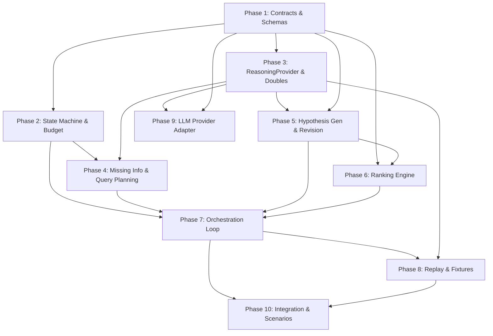

# Person 3 — Implementation Plan

## Missing-Information Analysis, Hypotheses, and Ranking

> **You are Person 3.** Your workstream owns the investigation intelligence: the state machine, missing-information detection, evidence query planning, hypothesis generation/revision, citation validation, deterministic ranking, and the final `RankedHypothesisSet` output. You access collection (Person 1) and storage (Person 2) only through shared contracts.

---

## Inputs You Consume

| Contract | Produced by | Purpose |
|---|---|---|
| `IncidentSeed` | Person 1 | Identity, service, severity, timestamps |
| `SourceCapabilityCatalog` | Person 1 | What each source can provide |
| `IncidentContextSnapshot` | Person 2 | Normalized evidence + timeline + coverage |
| `EvidenceRepository` (read interface) | Person 2 | Full `EvidenceRecord` lookup by ID |
| `InvestigationBudget` | Configuration | Round, query, time, and token limits |

## Outputs You Produce

| Contract | Consumer | Purpose |
|---|---|---|
| `MissingInformationAssessment` | Internal loop | Known facts, gaps, priorities |
| `EvidenceQueryPlan` | Person 1 | Queries to execute next |
| `Hypothesis` (intermediate) | Internal loop | Causal statements with citations |
| `RankedHypothesisSet` | **Final system output** | Ranked hypotheses with score breakdowns |

---

## Phased Implementation

### Phase 1 — Contracts, Schemas & Project Skeleton

**Goal:** Establish all Person 3 schemas, interfaces, and directory structure so everything else can be built and tested independently.

**Deliverables:**

#### [NEW] `contracts/investigation/`
- `InvestigationBudget` schema (JSON + Python dataclass/Pydantic model)
- `MissingInformationAssessment` schema
- `EvidenceQueryPlan` schema (with `query_id`, `source_type`, `parameters`, `related_information_ids`, `discriminates_hypothesis_ids`, `expected_information_value`)
- `Hypothesis` schema (with `revision`, `status`, `supporting_evidence`, `contradicting_evidence`, `missing_information_ids`, `testable_prediction`)
- `RankedHypothesisSet` schema (with `score_breakdown`, `remaining_uncertainty`, `budget_usage`, `status: completed | inconclusive`)
- Enumerations: `HypothesisStatus`, `RootCauseCategory`, `ConfidenceLabel`, `StopReason`
- Common error types for the investigation domain

#### [NEW] `contracts/hypothesis/`
- Separate hypothesis-specific types if contracts are split by domain

#### [NEW] `investigation/` directory structure
```text
investigation/
├── orchestration/
│   ├── __init__.py
│   └── state_machine.py
├── missing_information/
│   ├── __init__.py
│   └── assessor.py
├── query_planning/
│   ├── __init__.py
│   └── planner.py
├── budgets/
│   ├── __init__.py
│   └── budget_tracker.py
```

#### [NEW] `reasoning/` directory structure
```text
reasoning/
├── provider/
│   ├── __init__.py
│   ├── interface.py          # ReasoningProvider protocol
│   ├── fake_provider.py      # Deterministic test double
│   └── recorded_provider.py  # Replay from recorded responses
├── prompts_or_strategies/
│   └── __init__.py
├── hypotheses/
│   ├── __init__.py
│   ├── generator.py
│   ├── reviser.py
│   └── citation_validator.py
└── ranking/
    ├── __init__.py
    ├── feature_calculators.py
    └── ranking_engine.py
```

**Acceptance criteria:**
- All schemas round-trip through JSON serialization/validation
- Directory structure is created and importable
- Enumerations are complete and match the work-division contract examples

**Dependencies:** None — works against the published contract definitions.

---

### Phase 2 — Investigation State Machine & Budget Tracker

**Goal:** Implement the bounded investigation workflow engine and budget enforcement.

**Deliverables:**

#### [NEW] `investigation/orchestration/state_machine.py`
- States: `RECEIVED`, `ASSESSING_GAPS`, `COLLECTING_EVIDENCE`, `BUILDING_TIMELINE`, `GENERATING_HYPOTHESES`, `RANKING`, `COMPLETED`, `INCONCLUSIVE`, `CANCELLED`
- Legal transitions as defined in [ARCHITECTURE.md §9](file:///d:/Projects/RecoverIT/ARCHITECTURE.md#L854-L878)
- Reject illegal transitions with structured errors
- Monotonically increasing `state_version`
- Checkpoint/persist state before and after external calls
- Support cancellation from any non-terminal state

#### [NEW] `investigation/budgets/budget_tracker.py`
- Track: rounds used, queries issued, elapsed time, reasoning calls, input/output units consumed
- Expose `is_budget_exhausted()`, `remaining()`, `can_afford(estimated_cost)`
- Enforce all limits from `InvestigationBudget`
- Return structured budget-usage summary for `RankedHypothesisSet.budget_usage`

**Tests:**
- Every legal state transition succeeds
- Every illegal state transition is rejected with the correct error
- Budget tracker correctly detects exhaustion for each limit type
- State version increments on every transition
- Cancellation works from each non-terminal state

**Dependencies:** Phase 1 schemas only.

---

### Phase 3 — ReasoningProvider Abstraction & Test Doubles

**Goal:** Build the provider-neutral reasoning interface and two non-LLM implementations so all downstream phases can develop without a live model.

**Deliverables:**

#### [NEW] `reasoning/provider/interface.py`
```python
class ReasoningProvider(Protocol):
    async def assess_missing_information(
        self, incident, source_capabilities, context, active_hypotheses
    ) -> MissingInformationAssessment: ...

    async def plan_queries(
        self, missing_information, source_capabilities, context, budget
    ) -> EvidenceQueryPlan: ...

    async def generate_hypotheses(
        self, incident, context, limits
    ) -> HypothesisSet: ...

    async def revise_hypotheses(
        self, previous_hypotheses, new_context
    ) -> HypothesisSet: ...
```

#### [NEW] `reasoning/provider/fake_provider.py`
- Returns deterministic, hard-coded structured responses for each method
- Supports multiple scenario presets (e.g., "deployment-regression", "database-outage", "resource-exhaustion")
- All outputs conform to the schemas from Phase 1

#### [NEW] `reasoning/provider/recorded_provider.py`
- Loads pre-recorded request→response pairs from JSON fixture files
- Matches incoming requests by incident ID + round number
- Returns exact recorded output for replay testing

**Tests:**
- Fake provider returns valid schema-conforming output for each method
- Recorded provider replays responses deterministically
- Swapping providers does not change the caller contract
- Provider-specific response objects do not leak outside the adapter

**Dependencies:** Phase 1 schemas.

---

### Phase 4 — Missing-Information Assessment & Query Planning

**Goal:** Given an incident and its current context, identify gaps and produce an `EvidenceQueryPlan` constrained by source capabilities and budget.

**Deliverables:**

#### [NEW] `investigation/missing_information/assessor.py`
- Accepts `IncidentSeed`, `SourceCapabilityCatalog`, `IncidentContextSnapshot`, active hypotheses
- Calls `ReasoningProvider.assess_missing_information()`
- Validates the structured output:
  - `known_facts` reference existing evidence IDs
  - `missing_information` items have valid `candidate_sources` (present in catalog)
  - `priority` uses allowed values
- Returns validated `MissingInformationAssessment`
- Works correctly with an **empty** initial `IncidentContextSnapshot`

#### [NEW] `investigation/query_planning/planner.py`
- Accepts `MissingInformationAssessment`, `SourceCapabilityCatalog`, context, budget
- Calls `ReasoningProvider.plan_queries()`
- Validates the plan:
  - Each `source_type` exists in the catalog
  - Query parameters use only `supported_query_fields`
  - Time windows don't exceed `maximum_window_seconds`
  - `limit` doesn't exceed `maximum_items`
  - No duplicate queries (same source + overlapping parameters)
  - Budget can afford the planned queries
- Rejects invalid queries with structured warnings
- Supports `stop_reason` when no useful queries remain
- Returns validated `EvidenceQueryPlan`

**Tests:**
- Empty context produces meaningful missing-information items
- Queries only use capabilities advertised in `SourceCapabilityCatalog`
- Duplicate queries are rejected
- Queries exceeding time-window or item limits are rejected
- Budget enforcement prevents over-planning
- A plan with zero queries must have a `stop_reason`

**Dependencies:** Phase 1 schemas, Phase 2 budget tracker, Phase 3 fake provider.

---

### Phase 5 — Hypothesis Generation & Revision

**Goal:** Generate multiple root-cause hypotheses, link them to evidence, and revise them as new evidence arrives.

**Deliverables:**

#### [NEW] `reasoning/hypotheses/generator.py`
- Accepts `IncidentSeed`, `IncidentContextSnapshot`, configured limits (min 2, max 5 hypotheses)
- Calls `ReasoningProvider.generate_hypotheses()`
- Validates output:
  - At least `minimum_hypotheses` produced when evidence permits
  - Each hypothesis has a clear `statement`, `root_cause_category`, `affected_component`
  - `supporting_evidence[].evidence_id` all exist in the context
  - `contradicting_evidence[].evidence_id` all exist in the context
  - Each citation includes a `reason`
  - Includes a `testable_prediction`
  - Status is `active`
- Must include a hypothesis unrelated to recent changes when evidence permits
- Returns validated `HypothesisSet`

#### [NEW] `reasoning/hypotheses/reviser.py`
- Accepts previous `HypothesisSet` and new `IncidentContextSnapshot`
- Calls `ReasoningProvider.revise_hypotheses()`
- Can change status to `active`, `weakened`, or `rejected`
- Adds new hypotheses if new evidence warrants them
- Updates `revision` number
- Preserves rejected hypotheses (never deletes, only changes status)
- Re-validates all citations against the latest context

#### [NEW] `reasoning/hypotheses/citation_validator.py`
- Validates every `evidence_id` exists in the context or `EvidenceRepository`
- Rejects cross-incident evidence references
- Flags if the same citation appears as both support and contradiction without explanation
- Flags uncited factual claims as assumptions
- Marks truncated or low-reliability evidence
- Returns a validation report with pass/fail + details

**Tests:**
- Multiple hypotheses are generated for a well-evidenced scenario
- Recent deployment is **not** automatically ranked first (bias test)
- Supporting and contradicting evidence remain separate per hypothesis
- Invalid evidence IDs are rejected
- Cross-incident evidence IDs are rejected
- Revision preserves rejected hypotheses
- Revision increments the revision number
- Citation validator catches all error types defined above

**Dependencies:** Phase 1 schemas, Phase 3 providers, Phase 4 (for integrated flow).

---

### Phase 6 — Deterministic Ranking Engine

**Goal:** Compute the final evidence score using deterministic, individually testable feature calculators and produce the `RankedHypothesisSet`.

**Deliverables:**

#### [NEW] `reasoning/ranking/feature_calculators.py`
Individual, pure functions for each feature:

| Feature | Description | Score direction |
|---|---|---|
| `independent_source_support` | Count of distinct `source_type` values in supporting evidence | + |
| `symptom_coverage` | Fraction of incident symptoms explained by the hypothesis | + |
| `temporal_consistency` | How well the causal timeline aligns (change → symptom) | + |
| `change_consistency` | Whether the cited change plausibly causes the failure | + |
| `specificity` | How narrow/testable the hypothesis is | + |
| `prediction_support` | Whether the testable prediction was confirmed | + |
| `contradiction_penalty` | Strength of contradicting evidence | − |
| `missing_evidence_penalty` | Critical information that is still unresolved | − |

- All calculators are **deterministic** for fixed inputs
- Each returns a numeric value
- No calculator calls an LLM

#### [NEW] `reasoning/ranking/ranking_engine.py`
- Accepts a `HypothesisSet` + `IncidentContextSnapshot`
- Runs all feature calculators for each hypothesis
- Applies **configurable weights** (from a config file, not hard-coded)
- Computes `evidence_score` (0–100)
- Derives `confidence_label` from configured thresholds (e.g., ≥70 = high, ≥40 = medium, <40 = low)
- Deterministic tie-breaking (by `hypothesis_id` lexicographic order)
- Assigns unique ranks (1, 2, 3…)
- Produces `score_breakdown` per hypothesis
- Assembles `RankedHypothesisSet` with `status`, `remaining_uncertainty`, `budget_usage`
- Handles inconclusive case: if no hypothesis has valid supporting evidence, return `status: "inconclusive"`

**Tests:**
- Ranking is deterministic for identical inputs (run twice, assert equal)
- Equal-score tie-breaking is stable
- Each feature calculator tested in isolation with edge cases
- Weights are loaded from configuration (not hard-coded)
- Confidence label thresholds work correctly at boundaries
- Missing evidence applies a penalty
- Inconclusive status produced when warranted
- The model/LLM cannot directly assign the final numeric score

**Dependencies:** Phase 1 schemas, Phase 5 hypotheses.

---

### Phase 7 — Investigation Orchestration Loop

**Goal:** Wire everything together into the bounded investigation loop that drives the entire Person 3 workflow end-to-end.

**Deliverables:**

#### [NEW] `investigation/orchestration/orchestrator.py`
Implements the complete loop:

```text
Start with IncidentSeed and empty context
→ transition to ASSESSING_GAPS
→ assess missing information (Phase 4)
→ plan allowed queries (Phase 4)
→ transition to COLLECTING_EVIDENCE
→ call collection abstraction (Person 1 interface)
→ transition to BUILDING_TIMELINE
→ call context-building abstraction (Person 2 interface)
→ transition to GENERATING_HYPOTHESES
→ generate or revise hypotheses (Phase 5)
→ validate evidence citations (Phase 5)
→ check stopping rules
→ if more evidence useful → loop back to ASSESSING_GAPS
→ transition to RANKING
→ calculate ranking features (Phase 6)
→ create RankedHypothesisSet
→ transition to COMPLETED
→ stop
```

- Uses abstractions for Person 1 (`CollectionService`) and Person 2 (`ContextBuilder`) — never calls them directly
- Respects all stopping rules ([WORK_DIVISION.md §8.9](file:///d:/Projects/RecoverIT/WORK_DIVISION.md#L1060-L1077)):
  - Leading hypotheses have adequate coverage → rank
  - High-value questions resolved → rank
  - Remaining queries have low expected value → rank
  - Budget exhausted → rank or inconclusive
  - Required sources unavailable → inconclusive
- Persists state before and after each external call
- First pass works with an empty `IncidentContextSnapshot`
- Supports the inconclusive/abstention path

**Abstraction interfaces for Person 1 and Person 2 (consumed, not implemented):**

```python
class CollectionService(Protocol):
    async def execute(self, plan: EvidenceQueryPlan) -> RawEvidenceBatch: ...

class ContextBuilder(Protocol):
    async def build(self, incident_id: str, batch: RawEvidenceBatch) -> IncidentContextSnapshot: ...
```

**Tests:**
- Full loop with fake provider + in-memory stubs completes successfully
- Loop stops when budget is exhausted
- Loop stops when evidence is sufficient
- Loop handles inconclusive correctly
- State transitions follow the state machine exactly
- Each stopping rule is individually testable
- No remediation or execution path exists

**Dependencies:** All previous phases (2–6).

---

### Phase 8 — Replay, Fixtures & Recorded Runs

**Goal:** Enable deterministic replay of entire investigations without a live LLM or live data sources.

**Deliverables:**

#### [NEW] `tests/fixtures/person3/`
- Pre-built `IncidentContextSnapshot` fixtures for at least 3 scenarios:
  1. Deployment configuration regression
  2. Database outage (not deployment-related)
  3. Resource exhaustion
- Pre-built `SourceCapabilityCatalog` fixtures
- Pre-built `IncidentSeed` fixtures
- Recorded `ReasoningProvider` response files

#### [NEW] Replay-capable investigation runner
- Loads recorded provider responses
- Uses in-memory stubs for Person 1 and Person 2 interfaces
- Runs the full orchestration loop
- Produces deterministic `RankedHypothesisSet`
- Asserts output matches expected results

**Tests:**
- A full recorded run is replayable without a live model
- Replay produces identical output across runs
- Unavailable sources produce uncertainty rather than invented facts
- Provider replacement passes the same contract tests

**Dependencies:** Phase 7 orchestrator, Phase 3 recorded provider.

---

### Phase 9 — LLM Provider Adapter (Real Model)

**Goal:** Connect to an actual LLM for live investigation runs.

**Deliverables:**

#### [NEW] `reasoning/provider/llm_provider.py`
- Implements `ReasoningProvider` protocol using a configured LLM API (e.g., OpenAI, Gemini)
- Structured output schemas for each method (JSON mode / function calling)
- Prompt versioning (each prompt has a version string recorded in metadata)
- Token tracking (input + output units → mapped to `InvestigationBudget` units)
- Retry with bounded backoff on transient failures
- Schema-repair: one attempt to fix invalid structured output, then fail safely
- Records: provider name, model, prompt version, schema version, latency, token usage, estimated cost
- Does not store credentials in incident records
- Provider-specific objects do not escape the adapter

> [!IMPORTANT]
> The choice of LLM provider (OpenAI, Gemini, Anthropic, etc.) and the API key management approach need to be decided before this phase begins.

**Tests:**
- Valid structured output for each method (with recorded or mocked API)
- Invalid structured output triggers schema-repair attempt
- Repeated invalid output transitions to inconclusive
- Token/cost tracking is accurate
- Credentials are not logged or stored in evidence

**Dependencies:** Phase 3 interface, Phase 1 schemas.

---

### Phase 10 — Integration & Scenario Tests

**Goal:** Verify Person 3's components work together, and prepare for cross-person integration.

**Deliverables:**

#### Scenario tests covering all 5 required families:
1. Deployment configuration regression
2. Memory exhaustion
3. Dependency incompatibility
4. Actual database outage
5. Coincidental deployment (not the cause)

#### Contract tests for Person 3 boundaries:
- `EvidenceQueryPlan` consumed correctly by Person 1
- `IncidentContextSnapshot` consumed correctly from Person 2
- `RankedHypothesisSet` conforms to the published schema

#### Integration verification:
- End-to-end loop with fake provider produces valid `RankedHypothesisSet`
- Switching from fake to recorded provider works seamlessly
- All Person 3 acceptance criteria verified:
  - [x] System reports missing information
  - [x] Every query valid against `SourceCapabilityCatalog`
  - [x] ≥2 hypotheses for suitable scenarios
  - [x] Every hypothesis includes support + contradictions
  - [x] Every citation resolves to evidence
  - [x] Final ranking is reproducible for identical inputs
  - [x] Workflow stops at `RankedHypothesisSet`
  - [x] No remediation path exists
  - [x] Replacing `ReasoningProvider` doesn't change orchestration contracts

**Dependencies:** All previous phases.

---

## Dependency Graph



---

## Open Questions

> [!IMPORTANT]
> **LLM Provider Selection:** Which LLM provider should be used for the live adapter (Phase 9)? OpenAI, Gemini, Anthropic, or multiple? This affects API key management and prompt engineering.

> [!IMPORTANT]
> **Shared Contracts Package:** Are Person 1 and Person 2 setting up the `contracts/` package, or should Person 3 create the investigation/hypothesis sub-packages independently and merge later?

> [!NOTE]
> **Scoring Weights:** The initial feature weights for the ranking engine need to be tuned on the development scenario set. The plan assumes starting with equal weights and iterating. Is this acceptable for the first implementation pass?

> [!NOTE]
> **Programming Language:** The architecture recommends Python + FastAPI. Is the team aligned on this, or is a different stack being considered?

---

## Verification Plan

### Automated Tests
- `pytest` unit tests for each phase
- Contract tests validating JSON schema round-trips
- Integration tests running the full orchestration loop with fake providers
- Replay tests with recorded provider responses

### Manual Verification
- Run a complete investigation with a live LLM (Phase 9) against a fixture scenario
- Inspect the `RankedHypothesisSet` output for correctness and readability
- Verify the `score_breakdown` makes intuitive sense for the known ground truth
