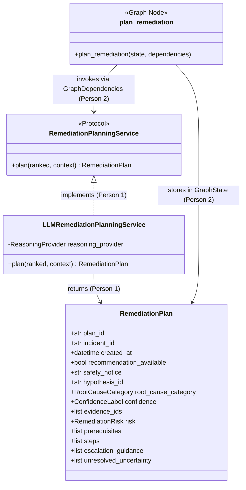

# RecoverIT Recommendation-Only Remediation: Two-Person Execution Plan

**Status:** Approved implementation specification  
**Audience:** Person 1 (Lead / Core Service & Contracts), Person 2 (Orchestration & Presentation), and their respective coding agents  
**Baseline Branch:** `cleanup`  
**Feature Branches:** `code-generation-person-1` and `code-generation-person-2`  
**Primary Architecture Reference:** `REMEDIATION_RECOMMENDATION_IMPLEMENTATION_PLAN.md`, `ARCHITECTURE.md`  
**Purpose:** Partition the recommendation-only remediation workstream into two strictly non-overlapping, equal halves so Person 1 and Person 2 (and their AI coding agents) can implement, test, and merge seamlessly without merge conflicts or intermediate glue code.

---

## 1. Read This First

RecoverIT currently stops after ranking hypotheses and outputting a `RankedHypothesisSet`. This workstream extends the investigation lifecycle so that every completed or inconclusive investigation also produces an evidence-grounded, human-actionable, operator-facing `RemediationPlan`.

```text
collect → build context → hypothesize → evaluate → rank
                                                   ↓
                                      plan remediation → END
```

### 1.1 Core Safety Invariants (Non-Negotiable)
1. **Recommendation Only**: The system produces descriptive operational guidance for human operators. It must **never** execute shell commands, run scripts, trigger rollbacks (`kubectl rollout undo`, `git reset`), invoke write APIs, restart services, or alter infrastructure.
2. **Provider-Neutral LLM Layer**: The remediation node interacts solely through the provider-neutral `ReasoningProvider` interface with schema-enforced structured generation at `temperature=0.0`.
3. **No Direct Adapter Queries**: The remediation planner consumes only the canonical `RankedHypothesisSet` and `IncidentContextSnapshot`. It never talks to collectors or external systems.
4. **Strict Evidence Provenance**: Every evidence ID cited in a remediation plan must exist in the ranked hypothesis and context snapshot. Fabricated citations are rejected.
5. **No Secret or Untrusted Echo**: Credentials, API tokens, raw log text, and untrusted shell scripts must never be echoed into plan instructions.
6. **Conservative Safety Downgrades**: Any low-confidence ranking, contradictory evidence, or inconclusive investigation must produce a safe, blocked plan with verification and escalation guidance, never a proposed production modification.
7. **Human Approval Mandatory**: Every remediation step recommending an action must have `requires_human_approval: true`.

---

## 2. Workstream Division & Ownership Matrix

The work is split into two halves of equal scope, complexity, and line count. The boundary is strictly decoupled via frozen contracts and protocols:

- **Person 1 (User)**: Owns **Contracts, Safety Policies, Reasoning Provider Extension, & Remediation Planning Service**.
- **Person 2**: Owns **LangGraph State & Node Wiring, Runtime Composition, Application Runner, CLI & Web Presentation**.

### 2.1 File Ownership Breakdown

| Area | File / Directory | Owner | Purpose |
|---|---|---|---|
| **Contracts** | `contracts/remediation/__init__.py` | **Person 1** | Package re-exports for remediation contracts |
| **Contracts** | `contracts/remediation/schemas.py` | **Person 1** | Canonical `RemediationRisk`, `RemediationStep`, `RemediationPlan` models |
| **Remediation Core** | `remediation/__init__.py` | **Person 1** | Public package re-exports |
| **Remediation Core** | `remediation/policies.py` | **Person 1** | Deterministic post-generation safety validator & sanitization |
| **Remediation Core** | `remediation/planner.py` | **Person 1** | `LLMRemediationPlanningService` implementing planning protocol |
| **Reasoning Provider** | `reasoning/provider/interface.py` | **Person 1** | Add `generate_remediation` method to `ReasoningProvider` |
| **Reasoning Provider** | `reasoning/provider/llm_provider.py` | **Person 1** | Implement prompt template and structured generation in `LLMReasoningProvider` |
| **Reasoning Provider** | `reasoning/provider/fake_provider.py` | **Person 1** | Deterministic test double implementation for tests |
| **Reasoning Provider** | `reasoning/provider/recorded_provider.py` | **Person 1** | Replay provider implementation for tests |
| **Test Support** | `tests/support/scripted_remediation_planner.py` | **Person 1** | In-memory programmable planner test double |
| **Tests (Contracts)** | `tests/contracts/test_remediation_contracts.py` | **Person 1** | Serialization, validation, and schema compliance tests |
| **Tests (Service)** | `tests/remediation/test_planner.py` | **Person 1** | Unit tests for planning service and provider calls |
| **Tests (Policies)** | `tests/remediation/test_policies.py` | **Person 1** | Unit tests for deterministic safety validation & downgrading |
| **Documentation** | `docs/handoffs/PERSON_1_REMEDIATION_HANDOFF.md` | **Person 1** | Person 1 handoff documentation and test proofs |
|---|---|---|---|
| **Graph Ports** | `investigation/graph/ports.py` | **Person 2** | Define `@runtime_checkable class RemediationPlanningService(Protocol)` |
| **Graph State** | `investigation/graph/state.py` | **Person 2** | Add `remediation_plan: RemediationPlan | None` to state & output |
| **Graph Dependencies** | `investigation/graph/dependencies.py` | **Person 2** | Add `remediation_planning_service` to `GraphDependencies` |
| **Graph Node** | `investigation/graph/nodes/remediate.py` | **Person 2** | Implement `plan_remediation` graph node |
| **Graph Node** | `investigation/graph/nodes/__init__.py` | **Person 2** | Re-export `plan_remediation` node |
| **Graph Builder** | `investigation/graph/builder.py` | **Person 2** | Wire `plan_remediation` node after `rank_hypotheses` and `finish_inconclusive` |
| **Composition** | `recoverit/composition.py` | **Person 2** | Instantiate and inject `LLMRemediationPlanningService` in `_build_live_dependencies` |
| **Runner** | `recoverit/runner.py` | **Person 2** | Add `remediation_plan` to `InvestigationResult` & markdown report |
| **CLI** | `recoverit/cli.py` | **Person 2** | Render rich terminal tables/panels for suggested remediation |
| **Web API** | `recoverit/web/configured.py` | **Person 2** | Include `remediation_plan` in API response payload |
| **Web Frontend** | `recoverit/web/static/index.html` | **Person 2** | HTML container for remediation recommendations |
| **Web Frontend** | `recoverit/web/static/app.js` | **Person 2** | Dynamic rendering of remediation steps, risk badges, and safety notices |
| **Web Frontend** | `recoverit/web/static/style.css` | **Person 2** | Visual styling for remediation panels, badges, and step cards |
| **Tests (Graph)** | `tests/graph/test_remediation_node.py` | **Person 2** | Unit tests for `plan_remediation` node execution and progress events |
| **Tests (Graph)** | `tests/graph/test_investigation_graph_remediation.py` | **Person 2** | Integration tests for full graph routing and checkpoint resume |
| **Tests (Runner)** | `tests/integration/test_remediation_runner.py` | **Person 2** | End-to-end live CLI/Runner tests with remediation output |
| **Documentation** | `docs/handoffs/PERSON_2_REMEDIATION_HANDOFF.md` | **Person 2** | Person 2 handoff documentation and test proofs |

---

## 3. Seamless Integration Boundary (Zero Glue Code)

Person 1 and Person 2 integrate directly through frozen interface definitions without any wrapper adapters or translation shims:



1. **The Contract**: Defined by Person 1 in `contracts/remediation/schemas.py`. Person 2 directly imports `from contracts.remediation.schemas import RemediationPlan`.
2. **The Protocol**: Defined by Person 2 in `investigation/graph/ports.py` as:
   ```python
   @runtime_checkable
   class RemediationPlanningService(Protocol):
       async def plan(
           self,
           ranked: RankedHypothesisSet,
           context: IncidentContextSnapshot,
       ) -> RemediationPlan: ...
   ```
3. **The Implementation**: Implemented by Person 1 in `remediation/planner.py` as:
   ```python
   class LLMRemediationPlanningService:
       def __init__(self, reasoning_provider: ReasoningProvider) -> None: ...
       async def plan(
           self,
           ranked: RankedHypothesisSet,
           context: IncidentContextSnapshot,
       ) -> RemediationPlan: ...
   ```
4. **The Wiring**: Person 2 instantiates `LLMRemediationPlanningService` in `recoverit/composition.py`:
   ```python
   from remediation.planner import LLMRemediationPlanningService
   # In _build_live_dependencies:
   remediation_service = LLMRemediationPlanningService(reasoning_provider=provider)
   # Passed into GraphDependencies(..., remediation_planning_service=remediation_service)
   ```

When both branches merge into `cleanup`, the code links without any adapters or glue.

---

## 4. Person 1 Specification: Core Contracts & Planning Service

### 4.1 Canonical Contracts (`contracts/remediation/schemas.py`)
All models inherit from `contracts.common.ContractModel` (Pydantic v2, `extra="forbid"`, `schema_version: Literal["1.0"] = "1.0"`).

```python
from datetime import datetime
from enum import StrEnum
from typing import Literal
from pydantic import Field
from contracts.common import ContractModel
from contracts.enums import ConfidenceLabel, RootCauseCategory

class RemediationRisk(StrEnum):
    LOW = "low"
    MEDIUM = "medium"
    HIGH = "high"
    BLOCKED = "blocked"

class RemediationStep(ContractModel):
    step_number: int = Field(ge=1, description="1-indexed execution order")
    title: str = Field(min_length=3, description="Short operator action summary")
    purpose: str = Field(min_length=5, description="Rationale for this step")
    instructions: list[str] = Field(min_length=1, description="Human-actionable guidance lines")
    expected_result: str = Field(min_length=3, description="Expected operational observation")
    verification: list[str] = Field(default_factory=list, description="Verification checks")
    rollback_guidance: list[str] = Field(default_factory=list, description="Safe reversal steps")
    requires_human_approval: bool = Field(default=True, description="Always true for safety")

class RemediationPlan(ContractModel):
    plan_id: str = Field(..., description="Unique plan identifier")
    incident_id: str = Field(..., description="Target incident identifier")
    created_at: datetime = Field(..., description="UTC creation timestamp")
    recommendation_available: bool = Field(..., description="True if safe actions proposed")
    safety_notice: str = Field(..., description="Prominent human-review safety banner")
    hypothesis_id: str | None = Field(default=None, description="Ranked hypothesis addressed")
    root_cause_category: RootCauseCategory | None = Field(default=None)
    confidence: ConfidenceLabel | None = Field(default=None)
    evidence_ids: list[str] = Field(default_factory=list, description="Cited evidence IDs")
    risk: RemediationRisk = Field(..., description="Operational risk tier")
    prerequisites: list[str] = Field(default_factory=list, description="Required initial state")
    steps: list[RemediationStep] = Field(default_factory=list, description="Sequential steps")
    escalation_guidance: list[str] = Field(default_factory=list, description="Escalation path")
    unresolved_uncertainty: list[str] = Field(default_factory=list, description="Remaining unknowns")
```

Validation rules:
- If `recommendation_available == True`: `hypothesis_id`, `root_cause_category`, `confidence`, at least one item in `evidence_ids`, and at least one item in `steps` are required.
- If `recommendation_available == False`: `risk` must be `RemediationRisk.BLOCKED`, `steps` must be empty, and either `escalation_guidance` or `unresolved_uncertainty` must be populated.
- Every step must have `requires_human_approval == True`.

### 4.2 Deterministic Safety Policies (`remediation/policies.py`)
Implement `validate_and_sanitize_remediation_plan(plan: RemediationPlan, ranked: RankedHypothesisSet, context: IncidentContextSnapshot) -> RemediationPlan`.
The policy engine runs after LLM output parsing and enforces:
1. **Evidence Grounding**: Checks that every ID in `plan.evidence_ids` is present in `ranked.top_hypothesis.supporting_evidence_ids` or `context.evidence_index`. Any unknown ID triggers a downgrade to `BLOCKED`.
2. **Command / Syntax Scrubbing**: Rejects strings resembling shell commands (`kubectl rollout`, `rm -rf`, `git reset`, `docker restart`, `systemctl`, `chmod`, `DROP TABLE`).
3. **Secret Scrubbing**: Rejects or redacts password/token/key values matching credentials patterns.
4. **Confidence Thresholding**: If `ranked.top_hypothesis.confidence` is not `ConfidenceLabel.HIGH`, or if contradictions exist, automatically downgrades `recommendation_available = False`, `risk = RemediationRisk.BLOCKED`, and replaces steps with escalation guidance.
5. **Fallback Safety Plan**: If validation fails, generates a deterministic, safe `BLOCKED` plan without raising unhandled exceptions.

### 4.3 Reasoning Provider Extension (`reasoning/provider/`)
1. In `reasoning/provider/interface.py`:
   Add `async def generate_remediation(self, ranked: RankedHypothesisSet, context: IncidentContextSnapshot) -> RemediationPlan` to `ReasoningProvider`.
2. In `reasoning/provider/llm_provider.py`:
   - Define versioned prompt constant: `PROMPT_VERSION_REMEDIATE = "generate_remediation:v1.0"`.
   - Build system instruction enforcing strict human-only recommendations, category-tailored advice, and no shell syntax.
   - Execute structured generation with `RemediationPlan` as target schema at `temperature=0.0`.
   - Handle parse failures with a single repair retry, falling back to a safe blocked plan.
3. In `fake_provider.py` & `recorded_provider.py`:
   - Implement deterministic stub and replay behavior for offline testing.

### 4.4 Planning Service (`remediation/planner.py`)
Implement `LLMRemediationPlanningService`:
```python
class LLMRemediationPlanningService:
    def __init__(self, reasoning_provider: ReasoningProvider) -> None:
        self.reasoning_provider = reasoning_provider

    async def plan(
        self,
        ranked: RankedHypothesisSet,
        context: IncidentContextSnapshot,
    ) -> RemediationPlan:
        # 1. If ranking is inconclusive or empty, return immediate blocked plan
        if not ranked.hypotheses or ranked.status != "completed":
            return create_inconclusive_remediation_plan(context)
        # 2. Invoke provider
        raw_plan = await self.reasoning_provider.generate_remediation(ranked, context)
        # 3. Enforce deterministic policy validation
        sanitized_plan = validate_and_sanitize_remediation_plan(raw_plan, ranked, context)
        return sanitized_plan
```

---

## 5. Person 2 Specification: LangGraph Wiring, Runtime Composition, & Presentation

### 5.1 Graph Ports & State (`investigation/graph/`)
1. In `investigation/graph/ports.py`:
   Add `RemediationPlanningService` protocol.
2. In `investigation/graph/state.py`:
   - Add `remediation_plan: RemediationPlan | None` to `InvestigationGraphState`.
   - Add `remediation_plan: RemediationPlan | None` to `InvestigationOutput`.
3. In `investigation/graph/dependencies.py`:
   - Add `remediation_planning_service: RemediationPlanningService` to `GraphDependencies`.

### 5.2 Remediation Node & Builder (`investigation/graph/nodes/remediate.py`, `builder.py`)
Implement `plan_remediation`:
```python
async def plan_remediation(state: InvestigationGraphState, dependencies: GraphDependencies) -> dict[str, Any]:
    ranked = state.get("ranked_result")
    context = state.get("context")
    plan = await dependencies.remediation_planning_service.plan(
        ranked=ranked,
        context=context,
    )
    return {
        "remediation_plan": plan,
        "progress_events": [
            ProgressEvent(
                timestamp=datetime.now(timezone.utc),
                kind="status",
                stage="plan_remediation",
                title="Remediation guidance prepared",
                detail=plan.safety_notice,
            )
        ],
    }
```
In `builder.py`:
- Add `"plan_remediation"` to `NODE_NAMES`.
- Update edges:
  ```python
  builder.add_edge("rank_hypotheses", "plan_remediation")
  builder.add_edge("finish_inconclusive", "plan_remediation")
  builder.add_edge("plan_remediation", END)
  ```

### 5.3 Runtime Composition (`recoverit/composition.py`)
In `_build_live_dependencies(settings, dispatcher)`:
- Instantiate `LLMRemediationPlanningService` with the live `provider`.
- Pass it to `GraphDependencies(..., remediation_planning_service=remediation_service)`.

### 5.4 Runner & Report (`recoverit/runner.py`)
1. In `InvestigationResult`: Add `remediation_plan: dict[str, Any] | None = None`.
2. In `to_markdown_report()`:
   Render section `## Suggested Remediation — Human Review Required`:
   - Display safety notice banner prominently.
   - If `recommendation_available == True`:
     - Show targeted hypothesis statement, category, confidence, and cited evidence IDs.
     - Show operational risk badge (`LOW`, `MEDIUM`, `HIGH`).
     - List prerequisites.
     - Render each numbered step with purpose, instructions, expected result, verification, and rollback guidance.
   - If `recommendation_available == False` (e.g. inconclusive or blocked):
     - Display `> **No production change recommended.**`
     - Render escalation guidance and unresolved uncertainties.

### 5.5 CLI & Web Presentation (`recoverit/cli.py`, `recoverit/web/`)
1. **CLI (`recoverit/cli.py`)**:
   Render formatted Rich panels/tables for the remediation plan. Highlight risk level and safety notice.
2. **Web API (`recoverit/web/configured.py`)**:
   Include `remediation_plan` in `/api/investigations/{id}` JSON response.
3. **Web UI (`index.html`, `app.js`, `style.css`)**:
   - Add `#remediation-section` container to UI layout.
   - Render step cards with collapsible verification & rollback sections.
   - For blocked plans, display amber/red banner: *"No production change recommended. Operator escalation required."*
   - Strictly omit any buttons that simulate automated execution (no "Apply", "Run", or "Rollback" buttons).

---

## 6. Coding Agent Prompts

These prompts must be provided to the coding agents working on Person 1 and Person 2.

### 6.1 Prompt for Person 1 Coding Agent

```markdown
You are Person 1 implementing the Core Contracts, Safety Policies, Reasoning Provider Extension, and Remediation Planning Service for RecoverIT.

Read REMEDIATION_TWO_PERSON_EXECUTION_PLAN.md completely before writing code.
Your branch is `code-generation-person-1`, branched from `origin/cleanup`.

Your owned paths are strictly:
- contracts/remediation/**
- remediation/**
- reasoning/provider/interface.py
- reasoning/provider/llm_provider.py
- reasoning/provider/fake_provider.py
- reasoning/provider/recorded_provider.py
- tests/contracts/test_remediation_contracts.py
- tests/remediation/**
- tests/support/scripted_remediation_planner.py
- docs/handoffs/PERSON_1_REMEDIATION_HANDOFF.md

Do NOT touch or modify:
- investigation/graph/**
- recoverit/**
- collectors/**
- evidence/**
- docs/handoffs/PERSON_2_REMEDIATION_HANDOFF.md

Your tasks:
1. Implement canonical Pydantic v2 schemas in contracts/remediation/schemas.py (RemediationRisk, RemediationStep, RemediationPlan) inheriting ContractModel with schema_version="1.0". Ensure extra="forbid".
2. Implement deterministic safety policies in remediation/policies.py to validate evidence citations, reject shell syntax/commands, scrub secrets, and downgrade low-confidence/contradictory hypotheses to safe BLOCKED plans.
3. Extend ReasoningProvider in reasoning/provider/interface.py with async def generate_remediation(self, ranked: RankedHypothesisSet, context: IncidentContextSnapshot) -> RemediationPlan.
4. Implement generate_remediation in LLMReasoningProvider (reasoning/provider/llm_provider.py) using structured output generation at temperature=0.0 with PROMPT_VERSION_REMEDIATE.
5. Update fake_provider.py and recorded_provider.py to implement generate_remediation for deterministic testing.
6. Implement LLMRemediationPlanningService in remediation/planner.py with async def plan(self, ranked: RankedHypothesisSet, context: IncidentContextSnapshot) -> RemediationPlan.
7. Implement ScriptedRemediationPlanningService in tests/support/scripted_remediation_planner.py for deterministic graph/integration test doubles.
8. Create comprehensive tests in tests/contracts/test_remediation_contracts.py and tests/remediation/test_planner.py, test_policies.py.
9. Verify all new and existing tests pass cleanly with .\pjtVenv\Scripts\python.exe -m pytest -q.
10. Commit logical milestones locally and push branch code-generation-person-1 to origin.
11. Write docs/handoffs/PERSON_1_REMEDIATION_HANDOFF.md containing commit SHA, files changed, test results, configuration, and runtime examples.
```

---

### 6.2 Prompt for Person 2 Coding Agent

```markdown
You are Person 2 implementing the LangGraph Orchestration Wiring, Runtime Composition, Runner, and CLI/Web Presentation for RecoverIT.

Read REMEDIATION_TWO_PERSON_EXECUTION_PLAN.md completely before writing code.
Your branch is `code-generation-person-2`, branched from `origin/cleanup`.

Your owned paths are strictly:
- investigation/graph/ports.py
- investigation/graph/state.py
- investigation/graph/dependencies.py
- investigation/graph/nodes/remediate.py
- investigation/graph/nodes/__init__.py
- investigation/graph/builder.py
- recoverit/composition.py
- recoverit/runner.py
- recoverit/cli.py
- recoverit/web/configured.py
- recoverit/web/static/app.js
- recoverit/web/static/index.html
- recoverit/web/static/style.css
- tests/graph/test_remediation_node.py
- tests/graph/test_investigation_graph_remediation.py
- tests/integration/test_remediation_runner.py
- docs/handoffs/PERSON_2_REMEDIATION_HANDOFF.md

Do NOT touch or modify:
- contracts/remediation/**
- remediation/**
- reasoning/provider/**
- collectors/**
- docs/handoffs/PERSON_1_REMEDIATION_HANDOFF.md

Your tasks:
1. In investigation/graph/ports.py, define the frozen protocol:
   @runtime_checkable class RemediationPlanningService(Protocol) with async def plan(self, ranked: RankedHypothesisSet, context: IncidentContextSnapshot) -> RemediationPlan.
2. In investigation/graph/state.py, add remediation_plan: RemediationPlan | None to InvestigationGraphState and InvestigationOutput.
3. In investigation/graph/dependencies.py, add remediation_planning_service: RemediationPlanningService to GraphDependencies.
4. In investigation/graph/nodes/remediate.py, implement the plan_remediation node calling dependencies.remediation_planning_service.plan(ranked, context) and emitting a ProgressEvent.
5. In investigation/graph/builder.py, register plan_remediation in NODE_NAMES and route:
   rank_hypotheses -> plan_remediation -> END
   finish_inconclusive -> plan_remediation -> END
6. In recoverit/composition.py (_build_live_dependencies), import LLMRemediationPlanningService from remediation.planner, instantiate it with provider, and pass it into GraphDependencies.
7. In recoverit/runner.py, extend InvestigationResult with remediation_plan and update to_markdown_report() to format the "Suggested Remediation — Human Review Required" section.
8. In recoverit/cli.py, render the remediation plan in rich terminal tables with risk badges and safety notices.
9. In recoverit/web/, expose remediation_plan in API responses (configured.py) and render step cards, verification, and rollback in app.js, index.html, style.css. Ensure no execution buttons exist.
10. Write tests in tests/graph/test_remediation_node.py, test_investigation_graph_remediation.py, and tests/integration/test_remediation_runner.py. (Use a scripted double or mock planner in graph unit tests).
11. Verify all tests pass cleanly with .\pjtVenv\Scripts\python.exe -m pytest -q.
12. Commit logical milestones locally and push branch code-generation-person-2 to origin.
13. Write docs/handoffs/PERSON_2_REMEDIATION_HANDOFF.md containing commit SHA, files changed, test results, configuration, and runtime examples.
```

---

## 7. Integration & Merge Workflow

```mermaid
gitGraph
   commit id: "cleanup-baseline"
   branch code-generation-person-1
   branch code-generation-person-2
   checkout code-generation-person-1
   commit id: "P1: contracts & policies"
   commit id: "P1: provider & planner"
   commit id: "P1: unit tests"
   checkout code-generation-person-2
   commit id: "P2: graph node & routing"
   commit id: "P2: composition & runner"
   commit id: "P2: CLI & web UI"
   checkout cleanup
   merge code-generation-person-1 id: "Merge P1 (Contracts & Core)"
   merge code-generation-person-2 id: "Merge P2 (Graph & Presentation)"
   commit id: "Full Verification: 100% Tests Pass"
```

### 7.1 Execution Steps
1. **Branching**:
   - Person 1 creates `code-generation-person-1` from `origin/cleanup`.
   - Person 2 creates `code-generation-person-2` from `origin/cleanup`.
2. **Parallel Implementation**:
   - Person 1 implements contracts, reasoning provider extension, safety policy validator, and `LLMRemediationPlanningService`.
   - Person 2 implements graph ports, node, builder routing, runtime composition, runner, CLI, and web presentation.
3. **Independent Verification**:
   - Person 1 runs `pytest tests/contracts/test_remediation_contracts.py tests/remediation/` and full regression suite.
   - Person 2 runs `pytest tests/graph/ tests/integration/` and full regression suite.
4. **Merge Sequence**:
   - Merge `code-generation-person-1` into `cleanup` first.
   - Merge `code-generation-person-2` into `cleanup` second.
   - Because file paths are completely disjoint, the merge produces **zero merge conflicts**.
5. **Final End-to-End Validation**:
   - Run full repository test suite: `pytest -q`.
   - Run live investigation smoke test: `python -m recoverit.cli investigate ...`.
   - Inspect generated Markdown report and web interface to confirm full remediation plan rendering.

---

## 8. Test Matrix & Acceptance Criteria

| Scenario | Expected Outcome | Responsible Tests |
|---|---|---|
| **High-confidence incident** | Detailed, human-actionable plan with 3-6 steps, prerequisites, verification, rollback guidance, and cited evidence IDs. | `test_planner.py`, `test_remediation_runner.py` |
| **Contradictory evidence** | Policy downgrades output to `BLOCKED`, `recommendation_available=False`, outputs conflict explanation and escalation guidance. | `test_policies.py` |
| **Low-confidence ranking** | Policy blocks proposed changes; produces verification-only guidance. | `test_policies.py` |
| **Inconclusive investigation** | Graph routes `finish_inconclusive -> plan_remediation -> END`, producing a safe blocked plan with escalation guidance. | `test_investigation_graph_remediation.py` |
| **Command syntax injection** | Policy rejects any string resembling shell commands (`kubectl`, `rm`, `git reset`, etc.) and returns safe blocked fallback. | `test_policies.py` |
| **Secret sanitization** | Credentials, tokens, and raw passwords never appear in plan instructions or progress events. | `test_policies.py`, `test_remediation_node.py` |
| **Graph checkpoint resume** | Investigation resumes from SQLite checkpoint and returns identical `remediation_plan` without recomputing. | `test_investigation_graph_remediation.py` |
| **CLI & Web UI presentation** | Displays prominent safety banner, risk badge, structured steps; no automated execution buttons. | `test_live_web_api.py`, CLI manual check |

---

## 9. Definition of Done

1. Every completed and inconclusive investigation concludes with a validated `RemediationPlan` stored in graph state.
2. Recommendations are strictly descriptive guidance for human operators; no executable syntax is generated.
3. The LangGraph workflow, not an ad-hoc loop, produces the remediation plan.
4. Person 1 and Person 2 branches merge into `cleanup` without file conflicts or interface discrepancies.
5. All unit, contract, graph, integration, and full regression tests pass (`pytest -q` reports 100% pass).
6. Both handoff documents (`docs/handoffs/PERSON_1_REMEDIATION_HANDOFF.md` and `docs/handoffs/PERSON_2_REMEDIATION_HANDOFF.md`) are complete with test commands, commit SHAs, and configuration notes.
