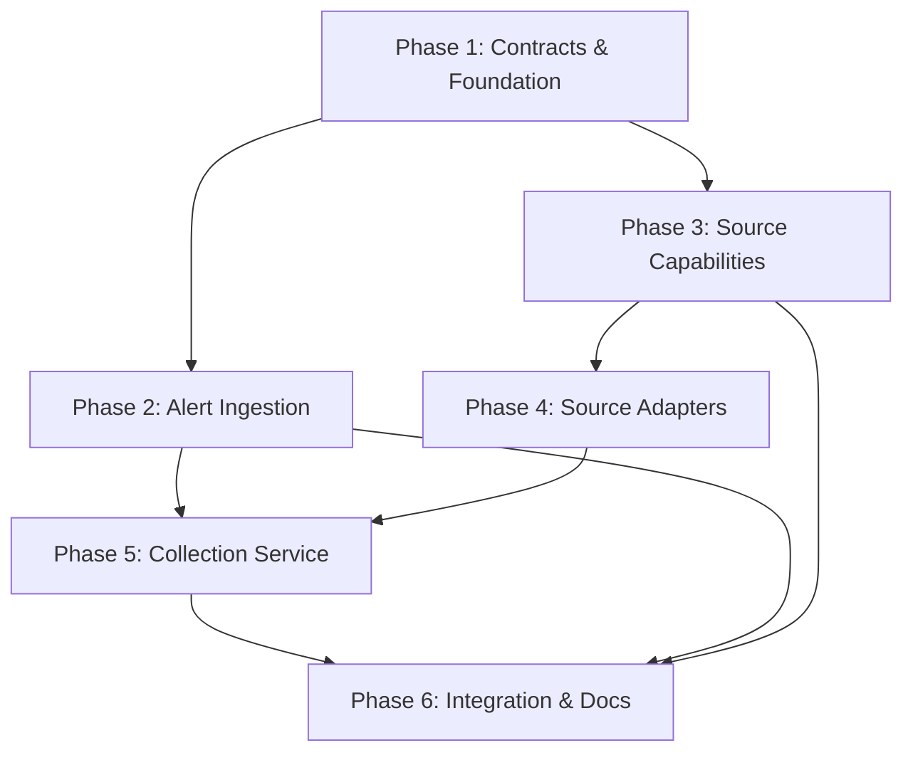

# Person 1 — Incident Intake & Multi-Source Collection: Implementation Plan

## Overview

Person 1 is responsible for building the **boundary layer** between the investigation system and operational data sources. This encompasses: receiving alerts, validating and creating `IncidentSeed`, discovering source capabilities, and executing evidence queries through replaceable adapters to produce `RawEvidenceBatch`.

The work produces three primary outputs consumed by the other team members:

| Output | Consumer |
|---|---|
| `IncidentSeed` | Person 2 (normalization), Person 3 (investigation) |
| `SourceCapabilityCatalog` | Person 3 (query planning) |
| `RawEvidenceBatch` | Person 2 (normalization & timeline) |

Person 1 consumes one input from Person 3:

| Input | Producer |
|---|---|
| `EvidenceQueryPlan` | Person 3 (investigation loop) |

During independent development (Stage 2), Person 1 will use **hand-written `EvidenceQueryPlan` fixtures** instead of waiting for Person 3's implementation.

---

## Phase 1: Shared Contracts & Project Foundation

> **Goal:** Establish the shared data contracts, project structure, and development tooling that all three team members depend on.

### 1.1 Project Scaffolding

- Initialize Python project with `pyproject.toml` (or equivalent).
- Set up linting, formatting, and test runner (e.g., `pytest`, `ruff`, `mypy`).
- Create the directory structure following [WORK_DIVISION.md §10](file:///d:/PJT_1/WORK_DIVISION.md#L1226-L1270):

```text
project/
├── contracts/                         # Shared; reviewed by all
│   ├── incident/
│   ├── collection/
│   ├── evidence/
│   ├── timeline/
│   ├── investigation/
│   ├── hypothesis/
│   └── errors/
├── ingestion/                         # Person 1
│   ├── alert/
│   ├── capabilities/
│   └── validation/
├── collectors/                        # Person 1
│   ├── gateway/
│   ├── logs/
│   ├── metrics/
│   ├── changes/
│   ├── deployments/
│   ├── pipelines/
│   ├── configuration/
│   └── fixtures/
├── tests/
│   ├── contract/
│   ├── integration/
│   ├── scenarios/
│   └── fixtures/
└── docs/
```

### 1.2 Shared Contract Definitions (Co-owned with Person 2 & Person 3)

Define versioned Pydantic (or dataclass) models for every contract exchanged between team members:

| Contract | Schema Reference |
|---|---|
| `IncidentAlert` | [WORK_DIVISION §6.4](file:///d:/PJT_1/WORK_DIVISION.md#L251-L275) |
| `IncidentSeed` | [WORK_DIVISION §6.5 — IncidentSeed](file:///d:/PJT_1/WORK_DIVISION.md#L307-L324) |
| `SourceCapabilityCatalog` | [WORK_DIVISION §6.5 — SourceCapabilityCatalog](file:///d:/PJT_1/WORK_DIVISION.md#L326-L362) |
| `EvidenceQueryPlan` | [WORK_DIVISION §8.5 — EvidenceQueryPlan](file:///d:/PJT_1/WORK_DIVISION.md#L867-L894) |
| `RawEvidenceBatch` | [WORK_DIVISION §6.5 — RawEvidenceBatch](file:///d:/PJT_1/WORK_DIVISION.md#L364-L398) |
| Common Error Format | [WORK_DIVISION §5.1](file:///d:/PJT_1/WORK_DIVISION.md#L181-L194) |

All contracts must:
- Include `schema_version` field.
- Use UTC timestamps in RFC 3339 format.
- Distinguish `event_time`, `observed_at`, `collected_at`, `received_at`.
- Be serializable to JSON and produce deterministic canonical JSON for hashing.
- Use enumerations for controlled fields (e.g., `severity`, `source_type`).

### 1.3 Shared Enumerations

Define enums for:
- `Severity`: `info`, `warning`, `critical`
- `SourceType`: `logs`, `metrics`, `changes`, `deployments`, `pipelines`, `configuration`
- `SourceStatus`: `ok`, `partial`, `unavailable`, `timeout`, `error`
- `SourceCoverage`: `available`, `not_queried`, `empty`, `unavailable`

### 1.4 Phase 1 Tests

- Contract models round-trip through JSON serialization/deserialization.
- Required fields are enforced; missing required fields raise validation errors.
- `schema_version` is present on every contract.
- Enumerations reject unknown values.

### 1.5 Phase 1 Deliverables Checklist

- [ ] Python project initialized with tooling.
- [ ] Directory structure created per ownership map.
- [ ] All shared contract models defined with validation.
- [ ] Shared enumerations defined.
- [ ] Common error format defined.
- [ ] Contract round-trip tests passing.
- [ ] `README.md` with project setup instructions.

---

## Phase 2: Alert Ingestion & IncidentSeed

> **Goal:** Build the alert intake boundary — validate incoming alerts, generate idempotent incident IDs, and produce `IncidentSeed`.

### 2.1 AlertIngestor Interface

Define the abstract interface per [WORK_DIVISION §6.6](file:///d:/PJT_1/WORK_DIVISION.md#L400-L414):

```python
class AlertIngestor(Protocol):
    def ingest(self, alert: IncidentAlert) -> IncidentSeed: ...
```

### 2.2 Alert Validation Rules

Implement validation per [WORK_DIVISION §6.4](file:///d:/PJT_1/WORK_DIVISION.md#L268-L275):

- `external_alert_id`, `service`, `environment`, `severity`, `detected_at`, `message` are **required**.
- `detected_at` must include timezone information.
- `severity` must be an allowed enumeration value.
- `labels` contain strings only.
- `message` and `labels` are treated as **untrusted data** (no interpretation).
- Repeated `external_alert_id` values are **idempotent** (return existing `IncidentSeed`).

### 2.3 IncidentSeed Construction

- Generate a unique `incident_id` (UUID or opaque identifier via `IdentifierGenerator` abstraction).
- Record `received_at` as the current time via `Clock` abstraction.
- Copy validated fields from `IncidentAlert`.
- Produce the `IncidentSeed` per the schema.

### 2.4 Idempotency & Deduplication

- Maintain an in-memory (or configurable) registry of `external_alert_id → incident_id`.
- Duplicate alerts within a configurable grouping window attach to the existing incident.
- Never create two incidents for the same `external_alert_id`.

### 2.5 Abstractions Introduced

| Abstraction | Purpose |
|---|---|
| `Clock` | Injectable time source (real or deterministic for tests) |
| `IdentifierGenerator` | Injectable ID generator (UUID or deterministic for tests) |
| `IncidentRepository` | Store/retrieve `IncidentSeed` by `incident_id` or `external_alert_id` |

### 2.6 Phase 2 Tests

Per [WORK_DIVISION §6.9](file:///d:/PJT_1/WORK_DIVISION.md#L449-L461):

- [ ] Valid alert produces exactly one `IncidentSeed`.
- [ ] Invalid alert (missing required fields) raises structured validation error.
- [ ] Invalid `severity` value rejected.
- [ ] `detected_at` without timezone rejected.
- [ ] Duplicate `external_alert_id` returns same `IncidentSeed` (idempotency).
- [ ] `message` and `labels` are passed through without interpretation.
- [ ] Output JSON validates against `IncidentSeed` schema.

### 2.7 Phase 2 Deliverables Checklist

- [ ] `AlertIngestor` interface defined.
- [ ] Concrete alert validation implementation.
- [ ] `IncidentSeed` construction logic.
- [ ] `Clock` and `IdentifierGenerator` abstractions with real and test implementations.
- [ ] In-memory `IncidentRepository` for deduplication.
- [ ] All Phase 2 tests passing.

---

## Phase 3: Source Capability Discovery

> **Goal:** Build the `SourceCapabilityCatalog` — a runtime declaration of what each data source can provide, enabling Person 3 to plan evidence queries without knowing adapter internals.

### 3.1 SourceRegistry Interface

```python
class SourceRegistry(Protocol):
    def capabilities(self, incident: IncidentSeed) -> SourceCapabilityCatalog: ...
```

### 3.2 Individual Source Interfaces

Define the six abstract source interfaces per [WORK_DIVISION §6.6](file:///d:/PJT_1/WORK_DIVISION.md#L400-L414):

```python
class LogSource(Protocol):
    def query(self, query: SourceQuery) -> SourceResult: ...

class MetricSource(Protocol):
    def query(self, query: SourceQuery) -> SourceResult: ...

class ChangeSource(Protocol):
    def query(self, query: SourceQuery) -> SourceResult: ...

class DeploymentSource(Protocol):
    def query(self, query: SourceQuery) -> SourceResult: ...

class PipelineSource(Protocol):
    def query(self, query: SourceQuery) -> SourceResult: ...

class ConfigurationSource(Protocol):
    def query(self, query: SourceQuery) -> SourceResult: ...
```

### 3.3 Capability Metadata

Each source adapter must declare:
- `source_type` (from enum).
- `available` (bool) — is this source reachable?
- `supported_query_fields` — what parameters this source accepts.
- `maximum_window_seconds` — max time-range for queries.
- `maximum_items` — max result count.

### 3.4 SourceCapabilityCatalog Construction

- Query each registered adapter for its capabilities.
- Handle unreachable sources gracefully (mark `available: false`).
- Attach `incident_id` and `generated_at` timestamp.

### 3.5 Phase 3 Tests

- [ ] Catalog includes all six source types.
- [ ] Unavailable source marked `available: false`, not omitted.
- [ ] No vendor-specific types in the output.
- [ ] Output JSON validates against `SourceCapabilityCatalog` schema.
- [ ] Source capability errors don't crash catalog generation.

### 3.6 Phase 3 Deliverables Checklist

- [ ] `SourceRegistry` interface defined.
- [ ] Six abstract source interfaces defined.
- [ ] `SourceCapabilityCatalog` builder.
- [ ] Capability metadata per source.
- [ ] All Phase 3 tests passing.

---

## Phase 4: Source Adapters (Fixture / Simulator)

> **Goal:** Build at least one fixture or simulator adapter for each of the six source types. These serve as the data layer for independent development and testing.

### 4.1 Fixture Adapter Design

Each fixture adapter:
- Returns pre-recorded, deterministic data from JSON fixture files.
- Implements the same source interface as a real adapter would.
- Supports configurable behaviors: success, partial results, unavailable, timeout.
- Never connects to live infrastructure.

### 4.2 Six Fixture Adapters

| Adapter | Source Type | Returns |
|---|---|---|
| `FixtureLogAdapter` | `logs` | Application logs, error events, container logs |
| `FixtureMetricAdapter` | `metrics` | Error rates, latency, CPU/memory, restart counts |
| `FixtureChangeAdapter` | `changes` | Git commits, changed files, diffs |
| `FixtureDeploymentAdapter` | `deployments` | Deployment events, versions, statuses |
| `FixturePipelineAdapter` | `pipelines` | Pipeline runs, stages, test results |
| `FixtureConfigurationAdapter` | `configuration` | Configuration changes, keys, values |

### 4.3 Fixture Data Files

Create fixture data for the five scenario families from [ARCHITECTURE §20.4](file:///d:/PJT_1/ARCHITECTURE.md#L1641-L1651):

1. **Bad database configuration** introduced by deployment.
2. **Memory exhaustion** and container restarts.
3. **Dependency incompatibility** causing a crash.
4. **Real database outage** without a relevant deployment.
5. **Coincidental deployment** that is not the cause.

Each scenario needs fixture data across all six source types with realistic timestamps, service names, and content.

### 4.4 Recorded-Fixture Replay Adapter

Build a generic replay adapter that:
- Loads recorded query → response pairs from files.
- Returns deterministic output for the same query.
- Supports offline testing and evaluation replay.

### 4.5 Phase 4 Tests

Per [WORK_DIVISION §6.9](file:///d:/PJT_1/WORK_DIVISION.md#L449-L461):

- [ ] Every adapter returning a successful result validates against `SourceResult`.
- [ ] Source unavailable scenario returns structured error.
- [ ] Partial and truncated results are correctly marked.
- [ ] Replay fixture returns deterministic output for same input.
- [ ] No credential-like data appears in fixture outputs.
- [ ] All outputs round-trip through JSON validation.

### 4.6 Phase 4 Deliverables Checklist

- [ ] Six fixture adapters implemented.
- [ ] Fixture data files for at least five scenario families.
- [ ] Recorded-fixture replay adapter.
- [ ] All Phase 4 tests passing.

---

## Phase 5: Collection Service & Query Execution

> **Goal:** Build the `CollectionService` that takes an `EvidenceQueryPlan` (from Person 3), validates and dispatches queries to the appropriate source adapters, and returns a `RawEvidenceBatch`.

### 5.1 CollectionService Interface

```python
class CollectionService(Protocol):
    def execute(self, plan: EvidenceQueryPlan) -> RawEvidenceBatch: ...
```

### 5.2 Query Validation

Per [WORK_DIVISION §6.7](file:///d:/PJT_1/WORK_DIVISION.md#L416-L428):

- Only execute query types present in `SourceCapabilityCatalog`.
- Validate query parameters against source capabilities (supported fields, time-window limits, item limits).
- Reject queries with invalid or missing required fields → structured error.
- Never silently broaden the requested service or time scope.

### 5.3 Query Dispatch & Execution

- Route each query to the correct source adapter by `source_type`.
- Apply per-source timeout.
- **Run independent read-only queries concurrently** when safe (using `asyncio.gather` or thread pool).
- Mark partial and truncated results.
- Preserve original source IDs.

### 5.4 RawEvidenceBatch Assembly

- Assign `batch_id` (via `IdentifierGenerator`).
- Record `collected_at` timestamp (via `Clock`).
- Aggregate individual query results into `results` array.
- Aggregate query errors into `errors` array.
- Attach `incident_id` and `plan_id` from the input plan.

### 5.5 Collection Rules Enforcement

Per [WORK_DIVISION §6.7](file:///d:/PJT_1/WORK_DIVISION.md#L416-L428):

- [ ] Do not interpret whether a record supports a hypothesis.
- [ ] Do not discard malformed records without a warning.
- [ ] Record collection duration and source status per query.
- [ ] Never include credentials in `RawEvidenceBatch`.
- [ ] Apply byte-size limits per source.

### 5.6 Structured Error Handling

- Source timeout → `SourceError` with `retryable: true`.
- Source unavailable → `SourceError` with `code: SOURCE_UNAVAILABLE`.
- Invalid query → `SourceError` with `code: INVALID_QUERY`.
- All errors follow the [Common Error Format](file:///d:/PJT_1/WORK_DIVISION.md#L181-L194).

### 5.7 Phase 5 Tests

Per [WORK_DIVISION §6.9](file:///d:/PJT_1/WORK_DIVISION.md#L449-L461):

- [ ] Valid `EvidenceQueryPlan` produces validated `RawEvidenceBatch`.
- [ ] Invalid query fields produce structured error (not crash).
- [ ] Query outside allowed time range rejected.
- [ ] Concurrent independent queries execute properly.
- [ ] Source timeout produces structured error, other queries still complete.
- [ ] All six evidence categories are represented in batch.
- [ ] Credential-like data not appearing in errors or batch output.
- [ ] All outputs round-trip through JSON validation.

### 5.8 Phase 5 Deliverables Checklist

- [ ] `CollectionService` implementation.
- [ ] Query validation against `SourceCapabilityCatalog`.
- [ ] Concurrent query dispatch.
- [ ] Timeout and limit enforcement.
- [ ] Structured error handling.
- [ ] `RawEvidenceBatch` assembly.
- [ ] All Phase 5 tests passing.

---

## Phase 6: Integration Testing & Documentation

> **Goal:** Validate that Person 1's outputs are consumable by Person 2 and Person 3 through contract tests, create hand-written fixtures for the full workflow, and write integration documentation.

### 6.1 Contract Tests

- [ ] `IncidentSeed` output consumed by Person 2's normalization pipeline (using shared schema).
- [ ] `SourceCapabilityCatalog` consumed by Person 3's query planner (using shared schema).
- [ ] `RawEvidenceBatch` consumed by Person 2's evidence normalizer (using shared schema).
- [ ] `EvidenceQueryPlan` from Person 3 consumed by `CollectionService` (using shared schema).

### 6.2 End-to-End Fixture Run

Create a recorded fixture that exercises the full Person 1 workflow:

```text
IncidentAlert
→ AlertIngestor.ingest() → IncidentSeed
→ SourceRegistry.capabilities() → SourceCapabilityCatalog
→ [hand-written EvidenceQueryPlan fixture]
→ CollectionService.execute() → RawEvidenceBatch
```

Verify the entire chain produces valid, schema-conforming output.

### 6.3 Integration Guide

Write documentation explaining:
- How to add a new source adapter (e.g., connecting to a real Loki, Prometheus, or GitHub API).
- Required interface methods and return types.
- How to register a new adapter with the `SourceRegistry`.
- How to write contract tests for a new adapter.

### 6.4 Phase 6 Deliverables Checklist

- [ ] Pairwise contract tests for all Person 1 ↔ Person 2 and Person 1 ↔ Person 3 interfaces.
- [ ] End-to-end fixture run passing.
- [ ] Integration guide document (`docs/integration-guide.md`).
- [ ] All tests passing.

---

## Dependency Map



> [!IMPORTANT]
> Phase 1 is a **shared dependency** — all three team members should agree on contracts before proceeding. Phases 2 and 3 can proceed in parallel after Phase 1. Phase 5 depends on both Phase 2 (for IncidentSeed) and Phase 4 (for adapters). Phase 6 is the final integration gate.

---

## Acceptance Criteria (from [WORK_DIVISION §6.10](file:///d:/PJT_1/WORK_DIVISION.md#L462-L474))

Person 1's work is complete when:

- [x] A valid alert produces exactly one `IncidentSeed`.
- [x] Available sources are described without vendor-specific types.
- [x] A valid `EvidenceQueryPlan` produces a validated `RawEvidenceBatch`.
- [x] All six evidence categories are represented.
- [x] Source failures do not crash the collection service.
- [x] No hypothesis or ranking logic exists inside collection code.
- [x] Person 2 can consume the output using only the published schema.
- [x] Person 3 can test against fixture outputs without a live data source.

---

## Output Format Summary

All Person 1 outputs strictly follow the JSON schemas defined in [WORK_DIVISION.md §6.4–6.5](file:///d:/PJT_1/WORK_DIVISION.md#L249-L398):

- **`IncidentSeed`** — validated incident record with `incident_id`, timestamps, service scope
- **`SourceCapabilityCatalog`** — per-source availability, supported query fields, limits  
- **`RawEvidenceBatch`** — collected evidence organized by query, with provenance and warnings

All outputs include `schema_version: "1.0"`, use UTC RFC 3339 timestamps, and produce deterministic canonical JSON.
